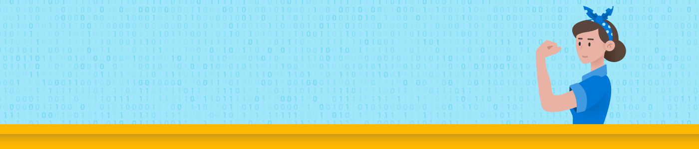

# Anyone can Code! – Light Your Fire for Coding

  

    Built with ❤ by everybody who wants to make the Microsoft App Dev Innovation world a little bit more diverse! 
  

## Agenda for the Anyone can Code workshop

On day 1 we will create our own GitHub Account and use this repository as our baseline. We will then use Azure Web Apps to host our Application. Further we play a bit around with the frontend to change our personal Headlines for our App and to understand the basic underlying concept of Azure. Further, we will use Azure Functions to automate our tasks. Storages and Databases are used to store our images or our data. All those Azure Services are used behind the scenes and can be consumed by our application aka personal App.

On Day 2 we will stay in the developer view by using our existing personal App and our goal is to make it smart with pre-trained machine models behind the scenes. For this we will focus on our managed services like Azure Cognitive Services: Face API and Speech API. As a future developer I can use those REST APIs and enrich my applications without having deep ml expert knowledge.
As a final challenge, you will connect your application with the services. This shows the entire lifecycle and brings together best of both worlds.

Afterwards, the trainers will suggest a long list of online courses to get started and to get a deeper dive into the technologies.
Further all the FemaleTechGen graduates are invited to join our [AI Developer College](https://github.com/aidevcollege/aidevcollege) or
[Azure Developer College](https://github.com/azuredevcollege/trainingdays).

  
 Female Tech ❤︎ All Generations

 

This workshop consists of multiple challenges, you have to complete. Your trainers will guide you through the workshop by giving you introduction talks to each of the topics/challenges you have to complete.

Here's the overview of the training week. Happy hacking!

## Hands on Guide - German/Deutsch

- [Day 1 - Github - Einen Account erstellen](day1/Github/DE_README.md)
- [Day 1 - Die Anwendung ins Netz und auf dein Handy bringen](day1/Application/DE_README.md)
- [Day 2 - Die Anwendung um Gesichtserkennung erweitern](day2/Face/DE_README.md)
- [Day 2 - Die Anwedung um Spracheerkennung erweitern](day2/Speech/DE_README.md)
- [Die Anwendung auf dem eigenen Rechner testen und entwickeln - Optional](day1/Application/DE_VSCODE_README.md)

## Hands on Guide - English/Englisch

- [Day 1 - Github - Create new Dreams](day1/Github/README.md)
- [Day 1 - Application on our Phone ](day1/Application/README.md)
- [Day 2 - Make our Application identify our face](day2/Face/README.md)
- [Day 2 - Make our Application understand our language](day2/Speech/README.md)

## Goal of the Anyone can Code Program for FEMALES in the ENTIRE ECOSYSTEM over Generations

The goal is to show all Females of any generation, that anything is possible also in the area of Tech and to light the fire in each of every Female to find the spark in Tech. We want to connect all generations of Females whether they are pupils, university students or professionals already performing in jobs. Further we want to connect those generations which haven't gotten in touch with Tech yet since we noticed that there is a huge gap between these communities. We believe there aren't enough Female Tech Heros yet.

However, it is possible to dive into Tech at any age, so we thought of starting with something that we are all familiar with - Applications on our phones. Together we will build an app on our phones which can take pictures and which we can talk to. And to put it in other (tech) words: _how to build a progressive Web App on our Phone which uses pre-trained Machine Learning models as restful endpoints_. The Application uses so-called REST APIs (don't worry we will explain this term later) and we will use Azure to meet the challenge to get it running.
To close the gap, we will first start with getting the application up and running and then secondly integrate the Machine Learning REST APIs. As a place where we can create our Tech Dreams we will use GitHub to create our space of collaboration as our motto always is: Sharing is Caring!

  

  

## Contributing

This project welcomes contributions and suggestions.

This project has adopted the [Microsoft Open Source Code of Conduct](https://opensource.microsoft.com/codeofconduct/).
For more information see the [Code of Conduct FAQ](https://opensource.microsoft.com/codeofconduct/faq/) or
contact [opencode@microsoft.com](mailto:opencode@microsoft.com) with any additional questions or comments.

  
This work is licensed under a [Creative Commons Attribution 4.0 International License](http://creativecommons.org/licenses/by/4.0/).
