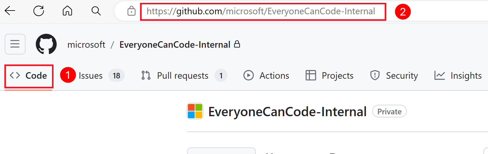

# Setup Local Development Environment on Mac OS

⏲️ _Est. time to complete: 45 min._ ⏲️

## Here is what you will learn 🎯

You wil learn the following:

- Installing Git
- Installing Python
- Installing Python Libraries
- Setting up Python Virtual Environment
- Installing Visual Studio Code

## Table Of Contents

1. [Install Git](#install-git)
2. [Clone the Repository](#clone-the-repository)
3. [Install Visual Studio Code](#install-visual-studio-code)
4. [Install Python](#install-python)
5. [Setup Python Virtual Environment](#setup-python-virtual-environment)
6. [Install Python Libraries](#install-python-libraries)

Depending on the operating system you are using, chose appropriate installation method below. For more details on Git and various installation refer to [Install Git on GitHub](https://github.com/git-guides/install-git)

## Install Git

Most versions of MacOS already have Git installed, and you can activate it through the terminal with git version. If you don't have Git installed, you can install the latest version using instructions below.

- Navigate to the latest [macOS Git Installer](https://sourceforge.net/projects/git-osx-installer/files/git-2.23.0-intel-universal-mavericks.dmg/download?use_mirror=autoselect) and download the latest version.
- Once the installer has started, follow the instructions as provided until the installation is complete.
- Open the command prompt "terminal" and type git version to verify Git was installed.

> Note: git-scm is a popular and recommended resource for downloading Git on a Mac. The advantage of downloading Git from git-scm is that your download automatically starts with the latest version of Git. The download source is the same macOS Git Installer as referenced in the steps above.

## Clone the Repository

1. From this repo, click on the "Code" button and copy the link to the repository
   

2. Open the terminal application.

3. Navigate to the directory where you want to store the project
  
4. Run the following command to clone the repository:

    ```bash
    git clone <link_to_this_repo>
    ```

5. Navigate to the project directory:

    ```bash
    cd <project directory>
    ```

## Install Visual Studio Code

Follow the instructions below install VS Code on your computer. Visit [Visual Studio Code download page](https://code.visualstudio.com/download) to download latest version of installation package for your computer operating system.

- Download VS Code installation package for Mac [by clicking here](https://code.visualstudio.com/sha/download?build=stable&os=darwin-universal)
- Go to the _Downloads_ folder on Mac and double click on installation package to extract packages.
- Move the Visual Studio Code application to the Application folder to make it available in the macOS launchpad.
- Launch Visual Studio Code from Applications to make sure it is working as expected

## Install Python

- Download latest stable release of Python installation package for Mac [by clicking here](https://www.python.org/ftp/python/3.12.2/python-3.12.2-macos11.pkg).
- Once the download is complete, go to the download folder and double-click on the package file to start installing Python.
- Click _Continue_ and follow onscreen instructions to install Python. Once installation is completes, it opens Python folder.
- To verify that the latest version of Python and IDLE installed correctly, double click on IDLE to show Python shell.
- Review Python version in the shell to confirm Python is installed correctly.

## Setup Python Virtual Environment

1. From the terminal window, navigate to the project directory

    ```bash
    cd <project directory>
    ```

    > [!TIP]
    > The repository for this training has a directory named `myApplication` that you can use as your default working directory while building the application or feel free to choose any directory where you would like to put this application.

2. Copy the following `requirements.txt` file from [Sprint 0](/Track_2_ToDo_App/Sprint-00%20-%20Environment%20Setup/src/requirements.txt) into your project directory.

3. Open up Visual Studio Code in the project directory by executing the following command.

    ```cmd
    code . 
    ```

4. From Visual Studio Code, either select "View/Command Palette" or press `Ctrl+Shift+P` to open the command palette.

    

5. In the search box, type `Python` and then select the option `Python: Create Environement...` from the list of options.

    

6. An environment type selection box will appear. Select `Venv Create a '.venv' environment in the current workspace` from the list of options.

    

7. Select the Python interpreter version to use for the virtual environment.  If you have multiple versions of Python installed, you should select the version that you installed in the previous step.

    

8. Check the box next to the `requirements.txt` file to install the required packages in the virtual environment and hit ok.

    

9. You will see a notification in the bottom right corner of the screen indicating that the virutal environment is being created.  This can take a few minutes to complete.

    

10. Once the virtual environment is created, you should see a notification in the bottom right corner of the screen indicating that the virtual environment has been created. 
    This will create a new directory called `.venv` in the project directory that will contain the virtual environment.  All python packages installed in this environment will be isolated from the global python environment.

11. Open up a terminal window in Visual Studio Code and activate the virtual environment by running the following command.

    ```cmd
    .venv\Scripts\Activate
    ```

    You should see the name of the virtual environment in the terminal prompt to indicate that the virtual environment is active.

## Install Python Libraries

Code examples in some of the sprints uses following Python libraries. If these modules are not already installed, install these libraries by following the instructions below.  Note however if you have already installed the virtual environment, you can skip this step as the libraries were installed as part of the virtual environment setup.

1. Open Visual Studio Code if it is already not open
2. Open Terminal window or Create a new terminal window in VS Code
3. Make sure __*pip*__ package manager installed in VS Code to install Python libraries. If not installed, follow the instructions below.

    - Download [get-pip.py](https://bootstrap.pypa.io/get-pip.py)

    - Run below command in the VS Code terminal window

    ```python
    python <Local folder path>\get-pip.py  
    ```

4. Copy the following `requirements.txt` file from [Sprint 0](/Track_2_ToDo_App/Sprint-00%20-%20Environment%20Setup/src/requirements.txt) into your project directory.

5. Now, install the required libraries by running the following command in the terminal window:

    ```python
    pip install requirements.txt
    ```
  
[🔼 Sprint 0 - Home](readme.md) [◀ Previous setup step](01%20-%20Setup%20GitHub%20Account.md) | [Next Sprint ▶](/Track_2_ToDo_App/Sprint-01%20-%20Basic%20Application/README.md)
