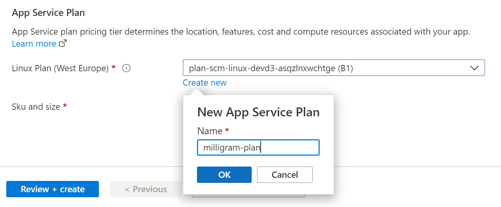
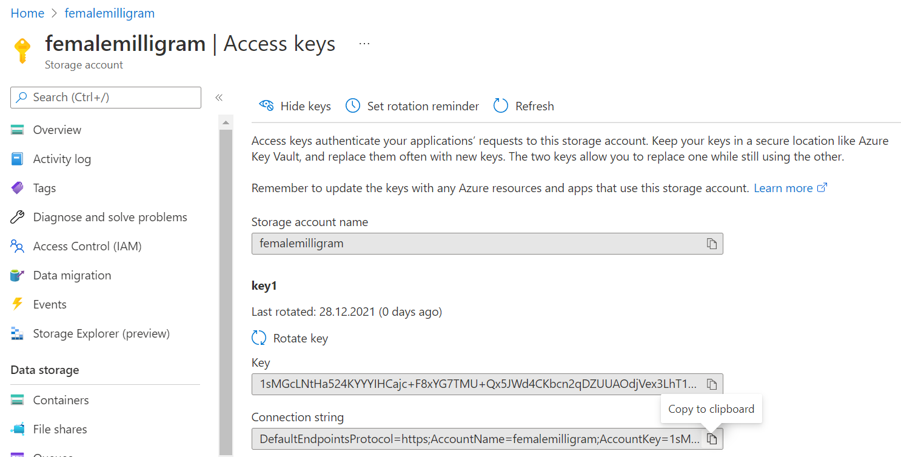

# Tag 1: Bereitstellung der Miligram-App auf Azure mit Github Actions

⏲️ _geschätzte Bearbeitungszeit: 60 min._ ⏲️

## Das wirst du lernen 🎯

Heute wirst du lernen, wie man:

- mit GitHub Actions loslegt
- das Milligram-Frontend auf GitHub Pages bereitstellt
- eine Python Web App auf Azure erstellt
- das Milligram-Backend auf Azure mit GitHub Actions bereitstellt

## Inhaltsverzeichnis

1. [Milligramm App Frontend](#milligram-app-frontend)
   1. [GitHub Actions aktivieren](#github-actions-aktivieren)
   2. [GitHub Actions ausführen](#github-actions-ausführen)
   3. [GitHub Pages in den Projekteinstellungen aktivieren](#github-pages-in-den-projekteinstellungen-aktivieren)
   4. [GitHub Pages auf dem Handy öffnen](#öffne-die-github-page-auf-deinem-handy)
   5. [App dem Startbildschirm hinzufügen](#die-app-zum-homescreen-hinzufügen)
2. [Milligram App Backend](#milligram-app-backend)
   1. [Das Hochladen von Bildern vorbereiten](#speicherkonto-erstellen)
   2. [Milligram-Backend-Code über GitHub Actions in die Azure Web App einbringen](#milligram-backend-code-über-github-actions-in-die-azure-web-app-einbringen)
   3. [Bild hochladen bereitstellen](#frontend-pipeline-erneut-ausführen)
3. [Zu viel? Wir haben die Lösung für dich!](#zu-viel-wir-haben-die-lösung-für-dich)

### Weitere Ressourcen:

- [Was ist eine Ressource / Ressourcengruppe / Abonnement?](https://docs.microsoft.com/azure/cloud-adoption-framework/govern/resource-consistency/resource-access-management)
- [Speech API](https://azure.microsoft.com/services/cognitive-services/speech-services/#overview)
- [Regionen und Availability Zones in Azure](https://docs.microsoft.com/azure/availability-zones/az-overview)
- [Github Verschlüsselte Geheimnisse](https://docs.github.com/en/actions/reference/encrypted-secrets)

## Milligram App Frontend

Lass uns mit der Frontend-App beginnen - der Teil, den du
auf deinem Handy oder deinem Webbrowser sehen und verwenden wirst. So könnt ihr mit Milligrams-Services interagieren.

Was bedeutet Frontend?

 

Stellen wir uns ein einfaches Auto vor. Alles, was du siehst - die Sitze, das Dach, den Boden, die Benutzerschnittstelle (Armaturenbrett, Lenkrad usw.) - das ist alles das **Frontend**.
Dann öffnest du die Motorhaube: und da ist es! Das **Backend** und die **API**. Du kannst den Motor, das Getriebe und einige andere Elemente sehen.
Aber wie ist dieses Beispiel nun zu verstehen... ganz einfach. Das **Frontend** ist das, was der Benutzer nutzt, um dem **Backend** über eine **API** Anweisungen zu geben. Wenn du also auf das Gaspedal trittst, beschleunigt der Motor.

Das Treten des Gaspedals löst im Frontend eine Anfrage an die API im Backend aus, damit der Motor beschleunigt, und der erforderliche Teil des Backends (in diesem Fall der Motor) führt sie aus.

### GitHub Actions aktivieren

Wir haben eine automatische Methode zur Erstellung und Aktualisierung der Website für dich vorbereitet. Du wirst zwei der großartigen Funktionen von GitHub nutzen. GitHub Pages und GitHub Actions. Lasst uns mit den Aktionen anfangen.

- Geh zu den **Actions** in deinem Repository.
- Klick auf den grünen Button mit dem du bestätigst, dass du Workflows verstehst, um GitHub Actions zu aktivieren.

_Ein [Repository] (https://docs.github.com/github/creating-cloning-and-archiving-repositories/creating-a-repository-on-github/about-repositories) enthält alle Dateien deines Projekts und den Revisionsverlauf jeder Datei. Du kannst die Arbeit an deinem Projekt innerhalb des Repositorys diskutieren und verwalten._

### GitHub Actions ausführen

- Klick auf der Registerkarte **Actions** deines Repositorys auf den Workflow **pages**.
- Öffne das Dropdown-Menü **Run workflow** und klick auf die Schaltfläche **Run workflow**, um die Ausführung des Workflows zu bestätigen.

Beobachte nun, wie der Workflow ausgeführt wird, und wirf einen Blick auf die einzelnen Schritte, die von GitHub für dich ausgeführt werden.

### Github Pages in den Projekteinstellungen aktivieren

Um die Website (Frontend) anzuzeigen, die wir mit Github Actions erstellt und bereitgestellt haben, müssen wir die Github Pages für dein Repository aktivieren. Github
Pages sind eine einfache Möglichkeit, eine statische Website von deinem Repository anzuzeigen.
Viele Leute nutzen sie, um die Dokumentation für ihre Projekte anzuzeigen. Wir verwenden sie,um das Frontend für Milligram zu erstellen.

- Geh zu deinen Repository-Settings
  
  
- Navigiere zu **Pages**
- Unter **Source**, wo aktuell **None** steht, wähl **_gh-pages_** aus (/(root) kann so stehen bleiben) und klick auf den Save-Button
  
  
- Die Bereitstellung dauert 1-2 Minuten. Danach ist die Milligram-Website über `https://<dein-Github-Benutzername>.github.io/FemaleAIAppInnovationEcosystem/` erreichbar. Den Link findest du auch weiter oben auf der Seite, auf der du dich gerade befindest.

Wirf einen Blick auf die Website. Versuch, das Profil mit deinem GitHub-Kontonamen zu ändern
und speicher die Änderung - schau dir an, was die Änderung bewirkt, auch wenn du den Browser aktualisierst.

### Öffne die GitHub Page auf deinem Handy

Milligram ist eine lustige kleine App, ähnlich wie die fotobasierten sozialen Medien, die dir vielleicht vertraut sind. Natürlich wollen wir sie auf unseren Handys benutzen, damit wir die Kamera nutzen können, um tolle Selfies und Bilder für Milligram zu machen. Die wichtigsten Funktionenen sind:

- Einfache Anzeige von GitHub-Kontoinformationen aus dem eigenen Profil
- Fotos machen und zu deiner Timeline hinzufügen
- Überprüfe dein Alter und deinen Gesichtsausdruck mit Azure Face Recognition (wird an Tag 2 implementiert)
- Transkribiere gesprochene Sätze mit Azure Speech Service (implementiert an Tag 2)

- Öffne deine persönliche Milligram-Website auf deinem Telefon und erkunde deren Inhalt
- Bearbeite dein Profil in der App, um dein eigenes GitHub-Profilbild in der App anzuzeigen
  

### Die App zum Homescreen hinzufügen

Auf modernen Handys kann man Webapplikationen auf dem Homescreen "installieren", damit sie leichter zugänglich sind und um sie mehr wie eine App aus den offiziellen Appstores aussehen zu lassen.

- Öffne das Browsermenü, um die Website zu deinem Startbildschirm hinzuzufügen:
  
  
- Jetzt kannst du die Website wie eine normale App vom Homescreen deines Telefons aus öffnen.

## Milligram App Backend

Das App-Backend empfängt hochgeladene Fotos, speichert sie für uns und gibt sie bei Bedarf zurück.

Unsere App kann in ein Frontend (etwas, das du siehst und lokal auf deinem Telefon läuft) und ein Backend (etwas, das deine Informationen verarbeitet) unterteilt werden. Da wir in diesem Fall unsere eigene Social-Media-App erstellen wollen, müssen wir Bilder für unseren "News Feed" speichern. Das bedeutet, dass wir einen Ort brauchen, an dem wir viele Dateien speichern können, und einen Ort, an dem unsere Applogik (d.h. unser Code) ausgeführt wird.

Um die Dateien zu speichern, werden wir den "Azure Storage Account" verwenden und um unsere Anwendung auszuführen, werden wir eine "Azure Web App" verwenden.
Als Erstes kannst du dich nun bei deinem "Azure-Konto" anmelden.

### Anmeldung bei Azure

Geh im Browser auf [portal.azure.com](https://portal.azure.com/?l=de.de-de#home).

[!Portal Azure Log In](./images/dark/AzurePortalLogin.png)

Jetzt melden wir uns mit unserem Azure-Konto an. Die Informationen für dein Azure-Konto findest du in der Excel Tabelle, die wir dir zur Verfügung gestellt haben, oder frag einfach deinen Trainer.

### Speicherkonto erstellen

Unser Speicherkonto ist der Ort, an dem wir unsere Bilder für unseren News Feed "speichern".
Innerhalb des Speicherkontos verwenden wir den so genannten Azure Blob Storage. Der Blob Storage kann eine große Menge an Dateien speichern.
Genau wie die Festplatte oder der Speicher auf deinem Computer. Ein cooler Fakt ist, dass du so viele Fotos auf dem Speicher speichern kannst, wie du möchtest und du musst dir keine Sorgen darum machen, dass du nicht genug Speicherplatz hast.

> **Azure Ressource**: In Azure bezieht sich der Begriff Ressource auf eine von Azure verwaltete Entität. Zum Beispiel virtuelle Maschinen, virtuelle Netzwerke, und Speicherkonten werden alle als Azure-Ressourcen bezeichnet. Manchmal sagen wir auch Azure-Service oder im Deutschen Azure-Dienst.

> **Ressourcengruppe**: Eine Ressourcengruppe ist ein Container, der verwandte Ressourcen für eine Azure-Lösung enthält. Die Ressourcengruppe kann alle Ressourcen für die Lösung enthalten, oder nur die Ressourcen, die du als Gruppe verwalten möchtest.

- Geh auf die Startseite des Azure-Portals
- Klick auf das große **+ _Ressource erstellen_**
- Such nach _Speicherkonto_ und klick auf _Erstellen_
- Wähl dein Abonnement aus und die Ressourcengruppe, die deinem Benutzernamen entspricht
- Gib deinem Speicherkonto einen _Speicherkontonamen_. Achtung, der Name muss eindeutig sein, dh. niemand anderes auf der Welt darf diesen Namen für ein Speicherkonto verwenden. Außerdem muss der Name klein geschrieben sein und darf keine Sonderzeichen enthalten.
- Stell sicher, dass du "Standard" für "Leistung" und "Lokal redundanter Speicher (LRS)" für "Redundanz" auswählst.
  
- Klick auf _Überprüfen & erstellen_, so werden deine Einstellungen noch einmal überprüft. Um die Erstellung des Speicherkontos abzuschließen kannst du noch einmal auf _Erstellen_ klicken. Das dauert einen Moment.
- Sobald das Speicherkonto erstellt ist sollte auf der Seite ein blauer Button auftauchen _Zu Ressource wechseln_. Wähle ihn aus.
- Nun solltest du dein Speicherkonto sehen. Unter _Datenspeicher_ im linken Menü, wähle _Container_ aus.
- Klick auf die Schaltfläche _+ Container_ und erstell einen Container mit dem Namen `images`. Drück noch einmal _Erstellen_.

Super! Du hast deinen ersten Azure-Service erstellt. Wenn du neugierig bist schau dir den Service gerne genauer an, oder lies dir unsere [Dokumentation](https://docs.microsoft.com/de-de/azure/storage/blobs/storage-blobs-overview) durch - nicht die ganze, das ist zu viel :wink: , aber schau gerne mal drauf.

### Web App erstellen

Unsere Azure Web App ist ein von Microsoft verwalteter Computer, auf dem du ganz einfach deine eigene Anwendung ausführen kannst, ohne dich um Software-Updates, Sicherheitsprobleme, Backups oder Hardware-Probleme kümmern zu müssen (wie du es vielleicht schon bei deinem Telefon erlebt hast).

- Geh wieder auf die Startseite des Azure Portals
- Klick auf _+ Ressource erstellen_, wie du es zuvor getan hast
- Such nach _Web App_, wähl das erste Ergebnis aus klick auf _Erstellen_
- Wähl dein Abonnement und deine Ressourcengruppe
- Stell sicher, dass du die Einstellungen entsprechend der Abbildung unten anpasst:
  - Name: `<Wähl deinen eigenen Namen>` (auch hier gilt wieder, der Name muss global eindeutig sein und nur bestimmte Sonderzeichen sind erlaubt)
  - Veröffentlichen: `Code`
  - Runtimestapel: `Python 3.8`
  - Betriebssystem: `Linux`
  - Region: `Westeuropa`
    
- Wähle den App Service Plan der zu deinem Nutzernamen passt.
  
- Klick auf _Größe ändern_ und dann auf die Registerkarte _Dev/Test_ und wähle **F1** aus, das kostenlos ist, andernfalls können bei der Erstellung eines größeren Plans Gebühren entstehen
  
- Klick auf _Überprüfen + erstellen_ am unteren Rand des Bildschirms
- Überprüfe die angezeigten Informationen und klick auf _Erstellen_ auf dem nächsten Bildschirm, um die Backend-App zu erstellen

:::tip
📝 Auf der Überprüfungsseite findest du Informationen über die geschätzten Kosten deines Services. Vergewissere dich, dass dort _Geschätzter Preis - Kostenlos_ angezeigt wird.
:::

### Speicher einbinden und Webapp konfigurieren

Verbinden wir nun unsere App mit unserem Speicher, damit du Bilder mit deinem Telefon aufnehmen und im Cloud-Speicher speichern kannst.
Wir müssen der Web App mitteilen, wo sie unseren Speicherdienst finden kann. Die App kann externe Konfigurationen verwenden, um die Verbindung mit dem Speicherkonto zu konfigurieren.

- Navigiere zurück zu deinem Speicherkonto. Du kannst in der Suchzeile oben nach dem Namen deines Speicherkontos suchen, oder auch einfach nur nach Speicherkonto. Dann werden dir alle Konten angezeigt und du kannst deins auswählen. Stell sicher, dass es wirklich dein Konto ist.
- Unter _Sicherheit + Netzwerkbetrieb_ auf der linken Seite klick auf _Zugriffsschlüssel_. Oben müsste _:eyes: Schlüssel anzeigen_ stehen - einmal draufklicken.
- Kopiere den geheimen _Schlüssel_ von deinem Speicherkonto und die _Verbindungszeichenfolge_ zum Beispiel in den Editor auf deinem Rechner.

- Navigiere zurück zur Web App, so wie du vorher zum Speicherkonto navigiert hast und öffne die Registerkarte _Konfiguration_ unter _Einstellungen_.
- Klick auf _Neue Verbindungszeichenfolge_ und erstelle einen neuen Verbindungsstring mit den folgenden Einstellungen:
  - Name: `STORAGE`
  - Wert: "<Füge deine (zuvor kopierte) Verbindungszeichenfolge vom Speicherkonto ein>".
  - Typ: `Custom`
- Klick auf `ok` und 💾 `Speichern`.
- Navigiere zum Reiter _CORS_ unter _API_ auf der linken Seite deines App-Services und gib `https://<dein GitHub Benutzername>.github.io` unter _Zulässige Ursprünge_ ein.
- Drücke 💾 `Speichern`

### Azure Web App konfigurieren

Es fehlt noch eine kleine Konfiguration. Unsere App nutzt einen fertigen Baustein damit Nutzer mit ihren Inhalten interagieren können. Aber dieser Baustein ist noch nicht installiert. Damit er installiert werden kann geben wir der Web App eine Konfiguration mit, die beim Start der App ausgeführt wird und es so ermöglicht, dass Nutzer mit den Daten unserer App interagieren können.

- Navigiere dafür zu **_Konfiguration_** unter _Einstellungen_
- Unter dem Tab **_Allgemeine Einstellungen_** findest du die _Stapeleinstellungen_. Das ist ein sehr gutes Beispiel für schlechte Übersetzung 😉. Unser App Backend ist in Programmiersprache Python - genauer Python Version 3.8 geschrieben.
- Unter **_Startbefehl_** gib `gunicorn -k uvicorn.workers.UvicornWorker` ein uns klick auf 💾 `Speichern`.

### Milligram-Backend-Code über GitHub Actions in die Azure Web App einbringen

Um sicherzustellen, dass unsere Social-Media-App tatsächlich etwas kann, müssen wir unseren Quellcode in die Azure Web App bringen. Um das zu tun, werden wir dieses sogenannte "Deployment" automatisieren. So müssen wir uns nicht jedes Mal auf einen manuellen Prozess verlassen, wenn wir Änderungen an unserer App vornehmen wollen (z.B. den Titel der App ändern), und wir vermeiden viele Fehler.

- Navigiere zur Registerkarte _Bereitstellungscenter_ unter _Bereitstellung_ auf der linken Seite des Azure Portals, immernoch unter deiner Web App
- Unter _Einstellungen_ wählst du als _Quelle_ _GitHub_ und klickst auf _Autorisieren_.
- Wähle unter _Organisation_ deinen GitHub-Handle und unter _Repository_ dein `FemaleAIAppInnovationEcosystem` Repo sowie den `main` _Branch_ aus. Alles andere kann so bleiben wie es ist.
- Drücke 💾 `Speichern`

Sobald du auf _Speichern_ klickst, erstellt der Dienst automatisch eine Workflow-Datei in deinem GitHub-Repository. Dieser Workflow wird sofort ausgeführt und nach etwa 2 Minuten ist deine Web-App fertig. Du kannst deine Bereitstellung auch unter der Registerkarte "Actions" in deinem GitHub Repository überprüfen. Die Farbe Grün ist immer ein gutes Zeichen. 😎

### Überprüfe, ob der Milligram Service korrekt läuft

Lasst uns eine Sekunde innehalten. Um sicherzustellen, dass du auf dem richtigen Weg bist, teste ob du eine Antwort von unserem Backend-Service erhältst. Bevor wir alles zusammenfügen, wollen wir sicherstellen, dass der Backend-Service wie erwartet funktioniert.

- Navigiere zur Registerkarte _Übersicht_ auf der linken Seite des App Services im Azure Portal

- Klick auf die _URL_ und teste die Website anhand der Dokumente, um herauszufinden, ob die Funktionen unseres Milligram funktionieren
- In deinem Browser solltest du die folgende Ansicht haben:

:::tip
📝 Wenn du nicht genau weißt was ein Swagger ist, dann lies dir gerne etwas mehr dazu bei [Wikipedia](<https://de.wikipedia.org/wiki/Swagger_(Software)>) durch.
:::

- Wähle den Endpunkt _GET/images_, klick auf `Try it Out` und dann auf `Execute`. Sobald du den 200 Response Code erhältst, hast du einen erfolgreich laufenden Dienst! Herzlichen Glückwunsch!

:::tip
📝 Schau dir auch gerne noch einmal die HTTP Response Codes bei [Wikipedia](https://de.wikipedia.org/wiki/HTTP-Statuscode) an. 2xx Codes drücken generell Erfolg aus, während 4xx und 5xx Codes unterschiedliche Arten von Fehlern anzeigen. Ihr kennt bestimmt 404 - Not Found.
:::

### Azure Web App Url in GitHub Secrets einbinden

Nun, da wir sicher sind, dass unser Backend-Service wie erwartet funktioniert, können wir alles zusammenführen.
Dazu verwenden wir ein GitHub-Feature namens _Secrets_, in dem du deine Backend-URL speichern kannst, damit dein Frontend mit dem Backend-Service kommunizieren kann.

- Wähle auf deiner Repository-Seite in GitHub _Settings_ und navigiere zu _Secrets_ > _Actions_
- Füge ein _New repository secret_ mit dem Namen `VUE_APP_IMAGE_API_URL` hinzu und setz als Wert `<Deine WebApp URL>`

  > ⚠️⚠️ Deine URL sollte auf einen **/** enden. Sie sollte in etwa so aussehen: `https://xxxx.azurewebsites.net/`

  
  
  
  

### Frontend Pipeline erneut ausführen

Damit die Änderung vom Hinzufügen des Geheimnisses im Frontend wirksam wird, müssen wir unsere Build-Pipeline erneut ausführen, damit der Prozess die neu erstellte Einstellung übernehmen kann.

- Navigiere zur Registerkarte _Actions_, wähle den _pages_ Workflow aus und führe den Workflow erneut aus:

- Sobald der Workflow gestartet ist, siehst du, dass der Workflow läuft (du kannst die Ansicht unten aufrufen, indem du auf den Workflow-Lauf klickst).

- und schließlich die Fertigstellung des Milligram-Services.

### Öffne die App - Mach ein Selfie und überprüfe deinen News Feed

Klick auf den Frontend-Link, der unter dem Deploy-Schritt in deiner Pipeline angezeigt wird `https://<IhrGithubHandle>.github.io/...`

Unsere Frontend-App sollte nun eine neue Schaltfläche mit einem Kamerasymbol haben, mit der wir Bilder aufnehmen können.
Diese Bilder sollten dann in der Timeline oder im News Feed erscheinen.

Nimm also mindestens 5 Bilder auf und stell sicher, dass sie in deiner App erscheinen. Stell sicher, dass du sie mit mindestens 1-2 Freunden teilst, damit auch sie ihre Fotos in deinem News Feed hochladen können.

Das war's für heute! Herzlichen Glückwunsch! 🥳🙏

Morgen werden wir unsere App intelligent machen, indem wir sie mit künstlicher Intelligenz ausstatten, um zu schätzen, wie alt du bist, und um mit unserer App zu sprechen.

## Zu viel? Wir haben die Lösung für dich!

Frag deinen Coach, wenn du nicht fertig geworden bist. Wir haben ein Back-up für dich. ⚠️

### Verwende den vorbereiteten Milligram Backend Service

Sieh dir die vorbereitete App mit unseren Bildern an, damit su mit [Milligram](https://codeunicornmartha.github.io/FemaleAIAppInnovationEcosystem/#/?stack-key=a78e2b9a) herumspielen kannst.

[◀ vorherige Challenge](../Github/DE_README.md) | [🔼 Home](../../README.md) | [nächste Challenge ▶](../../day2/Face/DE_README.md)
