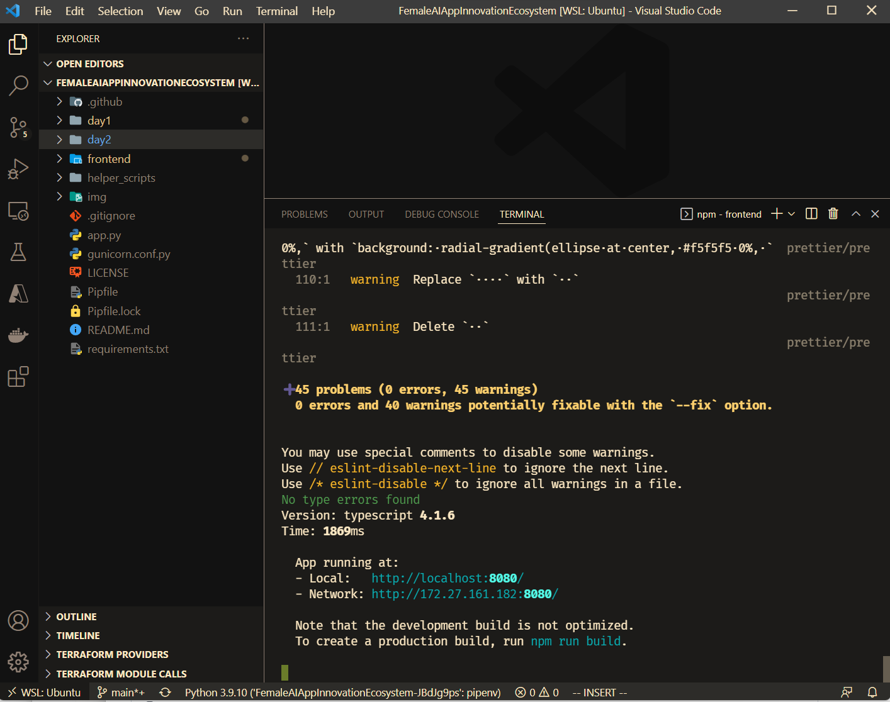

# Starten, Programmieren und Testen der WebApp auf deinem Rechner

Damit du die Vue.js Milligram App (das Frontend) auf deinem eigenen Rechener weiterentwickeln und verändern kannst musst du ein Paar Dinge auf deinem Rechner installieren.

## Vorraussetzungen für Vue.js Frontend installieren

[Node.js installieren](https://nodejs.org/en/download/)

Node.js ist eine Anwendung die es dir ermöglicht auch außerhalb deines WebBrowser die Programme in der Programmiersprache JavaScript auszuführen.

[Visual Studio Code installieren](https://code.visualstudio.com/)

Visuals Studio Code ist ein kleiner, aber sehr mächtiger Texteditor. Durch eine ganze Reihe von Erweiterungen lässt er sich an fast jede Programmiersprache oder Aufgabe anpassen.

## Projekt klonen, öffnen und starten

Started Visual Studio Code und nutzt die möglichkeit direkt ein Git Repositroy zu klonen.


Euer Projekt sollte sich direkt im Visual Studio Code Editor öffnen. Ihr könnt dann direkt im Terminal Bereich am unteren Bildschirmrand mit den folgenden Befehlen die Webseite starten und im Browser öffenen.

Jede Änderung am Programmcode wird direkt in der Anwendung sichtbar. (Es sei den man macht etwas kaputt, aber keine Sorge: Dank Versionskontrolle könnt ihr immer wieder auf die funktionierende Version zurückgehen.)

```shell
cd fronted
npm install
npm run serve
```



## Vorraussetzungen für das Backend installieren

Nutzt wieder VS Code als Editor.

[Installiert Python](https://www.python.org/)

Unter Windows 11 kannst du auch eine PowerShell öffenen und einfach `python`
eingeben. Falls Python noch nicht installiert ist öffnet sich der Microsoft
Store und du kannst Python mit einem klick installieren.

Python ist eine Programmiersprache die in unseren Augen besonders
einsteigerfreundlich und mächtig ist. Die Schwierigkeit liegt bei Python häufig
im Verwalten der Bibliotheken.

Im Hauptverzeichnis des Workshops kannst du dann mit folgendem Befehl das Backend starten:

```shell
pip install -r requirements.txt
uvicorn app:app
```

Die Anwendung erwartet, dass der ein Storage Account Connection String als `CUSTOMCONNSTR_STORAGE` als Umgebungsvariable gesetzt ist, damit er richtig funktioniert.

### Achtung

Unter Windows scheint der Befehl `pip install -r requirements.txt` nicht direkt zu funktionieren. Ggf. mal in einer Git Bash oder Cygwin versuchen.
