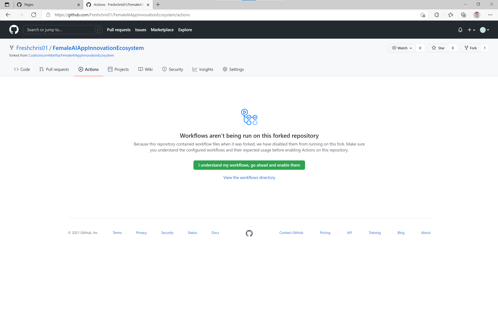
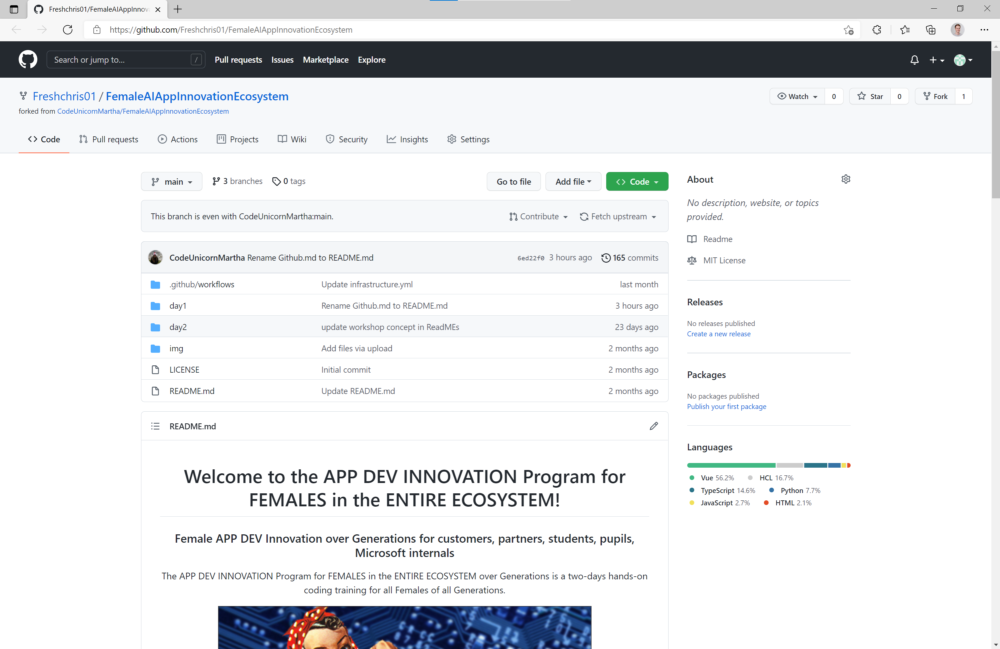
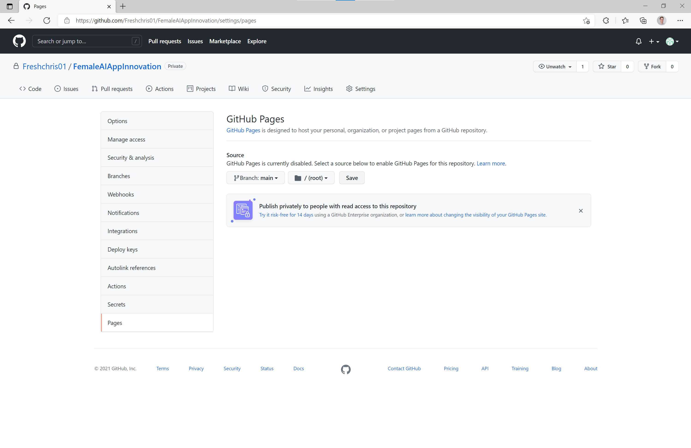
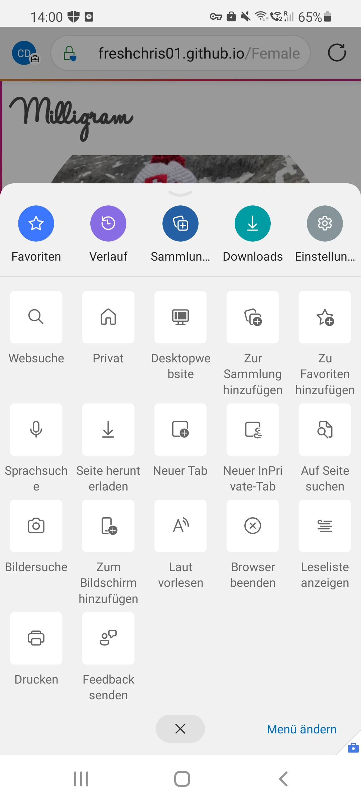
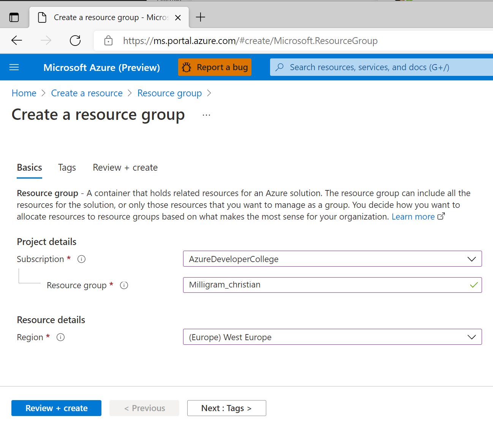
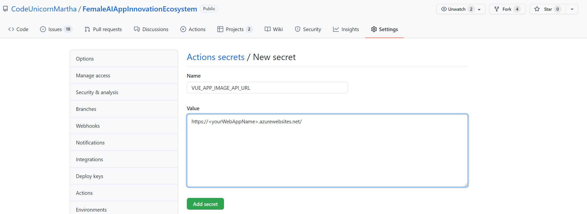
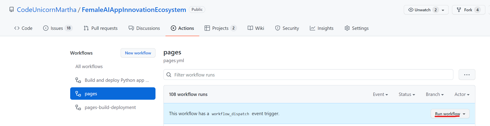
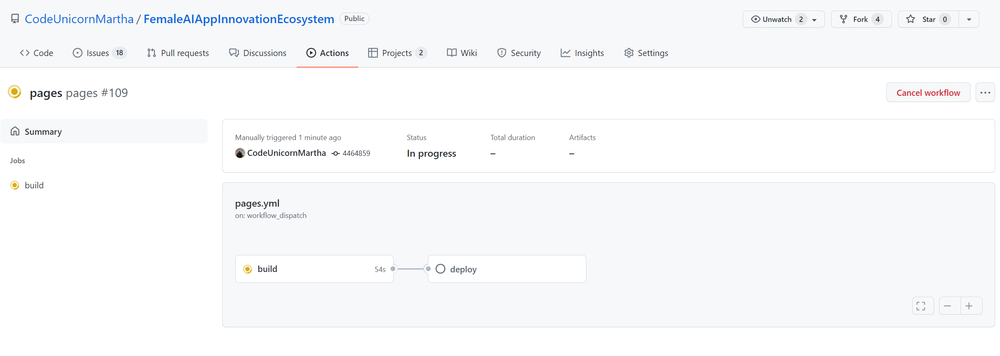
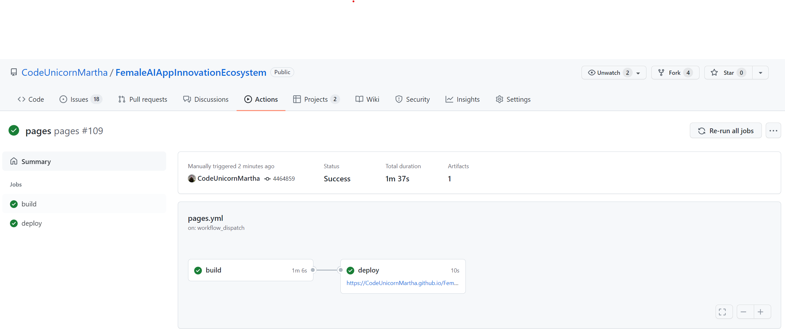

# Day 1: Deployment of Miligram application on Azure with Github Actions

⏲️ _Est. time to complete: 60 min._ ⏲️

## Here is what you will learn 🎯

Today you will learn how to:

- get started with GitHub Actions
- deploy the Milligram frontend to GitHub Pages
- create a Python Web App on Azure
- deploy the Milligram backend on Azure with GitHub Actions

## Table Of Contents

1. [Milligram Application Frontend](#milligram-application-frontend)
   1. [Enable GitHub Actions](#enable-github-action)
   2. [Run GitHub Actions](#run-github-action)
   3. [Enable GitHub Page in Project Settings](#enable-github-page-in-project-settings)
   4. [Open GitHub Page on your phone](#open-github-page-on-your-phone)
   5. [Add Application to home screen](#add-application-to-home-screen)
2. [Milligram Application Backend](#milligram-application-backend)
   1. [Prepare Image Upload](#prepare-image-upload)
   2. [Make Application Backend run in the Cloud](#make-application-backend-run-in-the-cloud)
   3. [Deploy Image Upload](#deploy-image-upload)
3. [Overcharged? We got you covered](#overcharged-we-got-you-covered)

### Further informative resources

- [What is GitHub Actions?](https://github.com/features/actions)
- [GitHub Actions Documentation](https://docs.github.com/actions)
- [What is a repository?](https://docs.github.com/github/creating-cloning-and-archiving-repositories/creating-a-repository-on-github/about-repositories)
- [What is a Resource / Resource Group / Subscription?](https://docs.microsoft.com/azure/cloud-adoption-framework/govern/resource-consistency/resource-access-management)

## Milligram Application Frontend

First let's get started with the front end application. The part that you will
see and use on your mobile phone or your web browser. This is the main way to
interact with Milligrams services.

### Enable GitHub Actions

We've prepared an automated way to create and update the website for you. You
will use two of GitHub's awesome features. GitHub Pages and GitHub Actions. Let's
get started with the actions.

- Go to your repository's **Actions**
- Click the button which says _I understand my workflows, go ahead and enable them_ to enable GitHub Actions

_A [repository](https://docs.github.com/github/creating-cloning-and-archiving-repositories/creating-a-repository-on-github/about-repositories) contains all of your project's files and each file's revision history. You can discuss and manage your project's work within the repository._

### Run GitHub Actions

- In the **Actions** tab of your repository, click on the **pages** workflow.
- Open the **Run Workflow** dropdown and click the **Run Workflow** button to confirm the workflow execution.

Now observe how the workflow is beeing run and take a look at the individual steps that are run for you by GitHub.

### Enable GitHub Pages in Project Settings

To be able to display the website (frontend) we've built and deployed using
GitHub Actions, we need to enable the GitHub Pages for your repository.  GitHub
Pages are an easy way to display a static website related to your repository.
Many people use it to display the documentation for their projects. We will use
it to serve the frontend for Milligram.

- Go to your repository settings
  
- Navigate to **Pages**, select the branch _gh-pages_ and hit the save button
  
- The deployment will take 1-2 minutes. After that, the Milligram website is
  accessible through `https://<your github username>.github.io/FemaleAIAppInnovationEcosystem/`

Take a look at the website. Try changing the profile to your GitHub account name
and see that it is stored even if you refresh the browser.

// TODO: Add Challenge to hange in Codespace + push

### Open GitHub Page on your phone

Milligram is a fun litte app similar to photo based social media that you might
be familiar with. Of course we want to use it on our mobile phones so we can use
the cameras to take awesome selfies and picture for Milligram. Its main
features are:

- Display simple GitHub account information from your own profile
- Take fotos and add them to the stream of images
- Check your age and facial expression using Azure Face Recognition (implemented on day 2)
- Transcribe sentences you speak using Azure Speech Service (implemented on day2)

- Open your personal Milligram website on your phone and explore it's content
- Edit the profile in the app to show your own GitHub profile picture in the app
  

### Add The application to your homescreen

On modern mobile phone you can "install" webapps on you homescreen to make them
easier accessible and make them look more like an app from the official
Appstores.

- Open the browser menu to add the website to your homescreen
   
- Now you can open the website like a normal app from the homescreen of your phone

## Milligram Application Backend

The Application Backend will receive uploaded photos, store them for us and return them when needed.  

Our Application can be divided into a Frontend (something you see and runs locally on your phone) and a Backend (something which processes your information). In this case, as we want to create our own social media application we need pictures to be stored for our "News Feed". That means we need a place to store many files and a place to run our application logic (which is our programming code). 

To store the files, we will use the "Azure Storage Account" and to run our application, we will use an "Azure Web App". 
First things first we will create our first "Azure Account".

### Create Azure Account

Go to your Browser and enter `microsoftazurepass.com`:

Afterwards enter `your Promo Code`:

If you have more questions, please ask your coach or click for more details [here](Redemption Process Guide - Microsoft Azure Pass).

### Log Into Azure

Go to your Browser and visit `portal.azure.com`.

Now we log in with `your Azure Account`

### Create a Resource and a Resource Group

- Click on _Create a resource_

> __Azure Resource__: In Azure, the term resource refers to an entity managed by Azure. For example, virtual machines, virtual networks, 
> and storage accounts are all referred to as Azure resources.

> __Resource Group__: A resource group is a container that holds related resources for an Azure solution. The resource group can include all the 
> resources > for the solution, or only those resources that you want to manage as a group.

- Search & select _Resource Group_ (A storage for multiple resources) from the text field

- Select your subscription
- Choose a name like `Milligram` to group all your resources related to this application

- Last but not least, select a region (e.g. West Europe) near you to host all your services

### Create Storage Account

Our storage account is the place where we "save" our pictures for our News Feed. 
Inside the storage account we use the so called Azure Blob Storage. The Blob Storage can hold a massive amount of files.
Just like the disk or storage on your Computer. A cool fun fact is that you can store as many photos on the storage as you like
and you don't have to worry about your storage space.

- Go to the start page of the Azure Portal
- Click on _Create a resource_ as you did before for the Resource Group
- Search for _Storage Account_ and click _Create_
- Select your subscription & the recently created resource group
- Make sure to select `Standard` for _Performance_ and `Locally-redundant storage (LRS)` for _Redundancy_
  
- Hit _Review & create_ to finish creating the storage account
- Once the Storage Account is created select _Containers_ on the left hand side
- Click the _New Container_ button and create a container named `images`

### Create Web App

Our Azure Web App is a Computer managed by Microsoft where you can easily run your own application without worrying about Software Updates, Security Issues, BackUp or Hardware Issues (as you might have already experienced on your phone).

- Go to the start page of the Azure Portal again
- Click on _Create a resource_ as you did before
- Search for _Web App_ and click _Create_
- Select your subscription & previously created Resource Group
- Make sure to adjust the settings according to the image below:
  - Name: `<pick your own unique name>`
  - Publish: `Code`
  - Runtime stack: `Python 3.8`
  - Operating System: `Linux`
  - Region: `West Europe`
    
- Create a new App Service Plan and `<pick your own name>`
  
- Click on _Change size_ and then click the _Dev/Test_ tab and select the **F1** which is free, otherwise you might be charged when creating a larger plan
  
- Click _Review + Create_ at the bottom of the screen
- Review the displayed information and click _Create_ on the next screen to spin up the backend application

:::tip
📝 On the review page, you can find information about the estimated costs of your service. Make sure it displays _Estimated price - Free_
:::

### Integrate Storage and configure Web App

Now let's connect our Application with our Storage that you can take pictures on your phone and store them in the Cloud Storage. 
We need to tell the Web Application where it can find our storage service. The application can take external configurations to configure the connection to the storage account. 

- For this reason copy the secret _Connection String_ from our Storage Account from _Access keys_

- Navigate back to the Web App and open the _Configuration_ tab, click _New connection string_ and create a new connection string with the following settings:
  - Name: `STORAGE`
  - Value: `<paste your (earlier copied) connection string from Storage Account>`
  - Type: `Custom`
- Hit `ok` and `Save`
- Navigate and Scroll down to the _CORS_ tab on the left hand side of your App Service and enter `https://<YourGithubHandle>.github.io` under _Allowed Origins_
- Hit `Save`

### Deploy Milligram Backend Code to Azure Web App via GitHub Actions

To ensure our social media application can actually do something, we need to bring our source code to the Azure Web App. To do that we will automate this so called "deployment". Hence, we don't have to rely on a manual process every time we want to make changes (e.g. changing the title of the application) to our application and thus, we avoid many mistakes. 

- Navigate to the _Deployment Center_ tab on the left hand side of your App
- Under the _Settings_ tab connect your _GitHub Account_ and click _Authorize_
- Under _Organization_ select your GitHub Handle and under _Repository_ select `FemaleAIAppInnovationEcosystem` as well as the `main` _Branch_
- Hit `Save`

Once you hit `Save` the service automatically creates a workflow file in your GitHub Repository. This workflow is immediately being executed and after about 2 minutes your web app is ready. You can also check your deployment on your "Actions" tab in your repository. The color green is always a good sign. 😎

### Check if Milligram Service is running correctly

Let's pause a second. To make sure that you are on track, test your application if you get a response from our backend service. Before we bring everything together, we want to make sure the backend service is working as expected. 

- Navigate to the _Overview_ tab on the left hand side of the App

- Hit the _URL_ and test the website using the docs to figure out if the features of our Milligram will work
- In your Browser you will have the following view:

- Select GET/images endpoint hit `Try it Out` and then hit `Execute`, once you get the 200 Response Code you have a successful running service! Congratulations!

### Integrate Azure Web App Url in Github Secret

Now that we are sure that our back end service works as expected we can bring everything together now.
To do this we will use a Github Feature called _Secrets_ where you can store your backend URL to make your frontend talk to the backend service. 

- On your Repository page select settings and navigate to secrets
- Add a _new secret_ named `VUE_APP_IMAGE_API_URL` and as value set `<your WebApp's URL>`

### Run Frontend Pipeline again

For the change of adding the secret taking effect in the frontend we need to run our build pipeline again so that the process can pickup the newly created setting.

- Navigate to Actions and select the pages workflow and rerun the workflow: 

- Once the workflow is started you will see the workflow running and finally finish.

- and finally finishing up the Milligram Service.

### Open the App - Take a Selfie and review your News Feed

Click on the frontend link displayed under the deploy step under your pipeline `https://<yourGithubHandle>.github.io/...`

Our frontend application should now have a new button with a camera symbol that allows us to take pictures.
These pictures should then appear on the timeline or News Feed.

So go ahead and take at least 5 pictures and make sure they appear in your app. Make sure to share them with at least 1-2 friends so they can also upload their photos to your News Feed. 

That's a wrap for today! Congrats! 🥳🙏

Tomorrow we will make our app smart by adding artificial intelligence to it for estimating how old you are as well as talking to our app.

## Overcharged? We got you covered

Ask your coach if you did not succeed. We have you covered with a back up. ⚠️

### Use prepared Milligram Backend Service

Look at the prepared application with our pictures for you to play around [Milligram](https://codeunicornmartha.github.io/FemaleAIAppInnovationEcosystem/#/?stack-key=a78e2b9a).

Interesting Links for you to read:

:::tip
📝
  - Link1
  - Link2
:::

[◀ Previous challenge](../Github/README.md) | [🔼 Day x](../../README.md) | [Next challenge ▶](../../day2/Face/README.md)