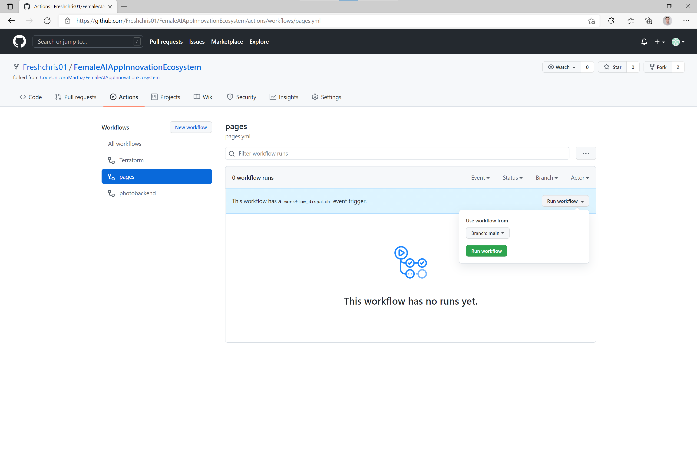

# Day 1: Deployment of Miligram application on Azure with Github Actions

⏲️ _Est. time to complete: 60 min._ ⏲️

## Here is what you will learn 🎯

In this day you will learn how to:

- get started with Github Actions
- deploy the Milligram frontend to Github Pages
- create a Python Web App on Azure
- deploy the Milligram backend on Azure with Github Actions

## Table Of Contents

1. [Milligram Application Frontend](#milligram-application-frontend)
   1. [Enable Github Action](#enable-github-action)
   2. [Run Github Action](#run-github-action)
   3. [Enable Github Page in Project Settings](#enable-github-page-in-project-settings)
   4. [Open Github Page on your phone](#open-github-page-on-your-phone)
   5. [Add Application to home screen](#add-application-to-home-screen)
2. [Milligram Application Backend](#milligram-application-backend)
   1. [Prepare Image Upload](#prepare-image-upload)
   2. [Make Application Backend run in the Cloud](#make-application-backend-run-in-the-cloud)
   3. [Deploy Image Upload](#deploy-image-upload)
3. [Overcharged? We got you covered](#overcharged-we-got-you-covered)

### Further informative resources

- [What is Github Action?](https://github.com/features/actions)
- [Github Action Documentation](https://docs.github.com/actions)
- [What is a repository?](https://docs.github.com/github/creating-cloning-and-archiving-repositories/creating-a-repository-on-github/about-repositories)
- [What is a Resource / Resource Group / Subscription?](https://docs.microsoft.com/azure/cloud-adoption-framework/govern/resource-consistency/resource-access-management)

## Milligram Application Frontend

### Enable Github Action

- Go to your repository **Actions**
- Click the button which says _I understand my workflows, go ahead and enable them_ to enable Github Actions

_A [repository](https://docs.github.com/github/creating-cloning-and-archiving-repositories/creating-a-repository-on-github/about-repositories) contains all of your project's files and each file's revision history. You can discuss and manage your project's work within the repository._

### Run Github Action

- In the **Actions** tab of your repository, click on the **pages** Action
- Open the **Run Workflow** dropdown and click the **Run Workflow** button to confirm the Action execution

// TODO: Add Challenge to hange in Codespace + push

### Enable Github Page in Project Settings

- Go to your repository settings
  
- Navigate to **Pages**, select the branch _gh-pages_ and hit the save button
  
- The deployment will take 1-2 minutes. After that, the Milligram website is accessible through `https://<your github username>.github.io/FemaleAIAppInnovationEcosystem/`

### Open Github Page on your phone

- Open your personal Milligram website on your phone and explore it's content
- Edit the profile in the app to show your own Github profile picture in the app
  

### Add The application to your homescreen

- Open the browser menu to add the website to your homescreen
   
- Now you can open the website like a normal app from the homescreen of your phone

## Milligram Application Backend

## Deploy Image Upload

### Create Azure Account

// Create Account + Subscription

### Create Resource Group

- Visit portal.azure.com & log in with your Azure Account
- Click on _Create a resource_

_Azure Resource: In Azure, the term resource refers to an entity managed by Azure. For example, virtual machines, virtual networks, and storage accounts are all referred to as Azure resources._

- Search & select _Resource Group_ (A storage for multiple resources) from the text field
  
- Select your subscription
- Choose a name like `Milligram` to group all your resources related to this application
- Last but not least, select a region near you to host all your services
  

### Create Storage Account

- Go to the start page of the Azure Portal
- Click on _Create a resource_ as you did before for the Resource Group
- Search for _Storage Account_ and click _Create_
- Select your subscription & the recently created resource group
- Make sure to select `Standard` for _Performance_ and `Locally-redundant storage (LRS)` for _Redundancy_
  
- Hit _Review & create_ to finish creating the storage account
- Once the Storage Account is created select _Containers_ on the left hand side
- Click the _New Container_ button and create a container named `images`

### Create Web App

- Go to the start page of the Azure Portal again
- Click on _Create a resource_ as you did before
- Search for _Web App_ and click _Create_
- Select your subscription & previously created Resource Group
- Make sure to adjust the settings according to the image below
  
- Create a new App Service Plan
  
- Click the _Dev/Test_ tab and select the **F1** which is free, otherwise you might be charged when creating a larger plan
  
- Click _Review + Create_ at the bottom of the screen
- Review the displayed information and click _Create_ on the next screen to spin up the backend application

:::tip
📝 On the review page, you can find information about the estimated costs of your service. Make sure it displays _Estimated price - Free_
:::

### Integrate Storage

### Enter Credentials and copy connection string to Github Secret

### Create Service Principal for Subscription

## Make Application Backend run in the Cloud

### Deploy Milligram Backend Code to Azure Web App via Github Action

### Test Backend

### Integrate Azure Web App Url in Github Secret

### Run Frontend Pipeline again

### Open the App - Take a Selfie and review your News Feed

## Overcharged? We got you covered

### Use prepared Milligram Backend Service

Tipp template

:::tip
📝 This is a special hint.
:::
