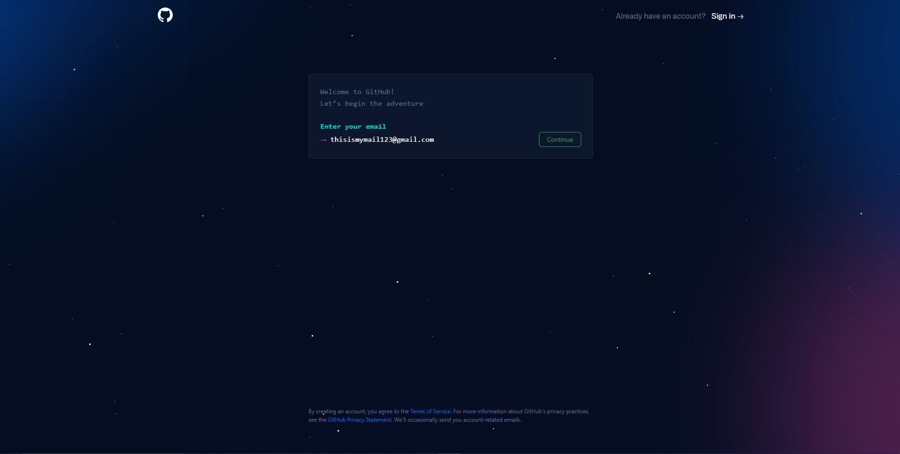

# Challenge 1: Github

⏲️ _geschätzte Zeit: 30 min._ ⏲️

## Das wirst du lernen 🎯

In dieser Challenge lernst du, wie man:

- sich bei Github anmeldet und einen Account erstellt
- sein Profil bearbeitet und ein Bild hochlädt
- ein Repository forkt

## Inhaltsverzeichnis

1. [Anmelden und ein GitHub-Konto erstellen](#anmelden-und-ein-github-konto-erstellen)
2. [Dein GitHub Profil bearbeiten](#dein-github-profil-bearbeiten)
3. [Repository forken](#repository-forken)

## Anmelden und ein GitHub-Konto erstellen

Was ist Github?

 

Github besteht eigentlich aus zwei Dingen: **Git** und **Hub**.

**Git** ist eine Software zur Versionskontrolle. Sie ermöglicht es Entwicklern, gleichzeitig an einem bestimmten Projekt zu arbeiten und die Änderungen zu verfolgen. Wenn etwas schief geht, können Sie die Änderungen mit Git leicht rückgängig machen.
**Hub** ist an sich nichts Besonderes, aber es stellt das "soziale Netzwerk" der Entwickler dar, das auf Git aufbaut. Github ist zwar nicht Eigentümer der Git-Software, hat aber eine Plattform geschaffen, die den Zugang zu Git und die Zusammenarbeit mit Git erleichtert. Die bahnbrechende Eigenschaft von GitHub ist, dass es super einfach ist, Ihren Code mit der Welt zu teilen/zu zeigen oder ihn einfach zu speichern. Sie müssen sich nicht mehr darum kümmern, wo Sie Ihren Code speichern. Unternehmen haben aus demselben Grund Github-Konten. Github bietet eine einfache Möglichkeit, Ihren Code online mit integrierter Versionskontrolle zu speichern.

- Erstelle ein GitHub-Konto, um loszulegen
- Füge einfach deine Email Adresse, ein genügend komplexes Passwort und einen Nutzernamen deiner Wahl ein 
  

- Gib **y** ein, um E-Mails von GitHub über neue Produktaktualisierungen und -ankündigungen zu erhalten. Oder **n**, um keine E-Mails von Github über Produktaktualisierungen und -ankündigungen zu erhalten..
  

- Um das Konto zu **verifizieren**, folge bitte den Anweisungen.
  

## Dein GitHub Profil bearbeiten

### Lade ein Profilbild hoch und füge deinen Namen ein

Dies ist die Startseite deines Kontos. Diese Übersicht zeigt alles über deine Aktivitäten auf GitHub, wie z. B. Beiträge zu Repositories, deine eigenen Repositories, Erfolge und mehr.

Um Deine Informationen zu ändern oder hinzuzufügen, klicke auf dein Benutzersymbol in der oberen rechten Ecke und wähle **Einstellungen**.
[Popup-Fenster mit Optionen für das Benutzersymbol oben rechts](./images/dark/Settings.png#gh-dark-mode-only)

- Klicke auf **Profil** und füge deine öffentlichen Informationen hinzu.
  
  

## Repository forken

Ein **_Fork_** ist eine Kopie eines Repositorys. Dies ist äußerst praktisch, wenn du frei experimentieren willst, ohne Änderungen am Originalprojekt vorzunehmen.

Also, machen wir weiter und forken dieses Repository!

[🔼 Home](../../README.md) | [nächste Challenge ▶](../Application/DE_README.md)
