# Challenge 1: Github

⏲️ _Est. time to complete: 30 min._ ⏲️

## Here is what you will learn 🎯

In this challenge you will learn how to:

- How to sign up at Github and create an Account
- How to edit your profile and upload a picture
- How to fork a repository

## Table Of Contents

1. [Sign Up and Create a GitHub Account](#SignUpandCreateatGithubAccount)
2. [Edit your GitHub Profile](#EditGithubProfile)
3. [Fork Repository](#ForkRepository)

## Sign Up and Create at GitHub Account

- Create a GitHub account to get started
- Simply add your email, password and your desired username
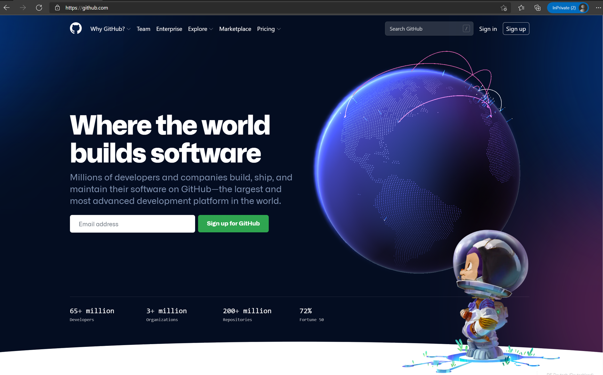

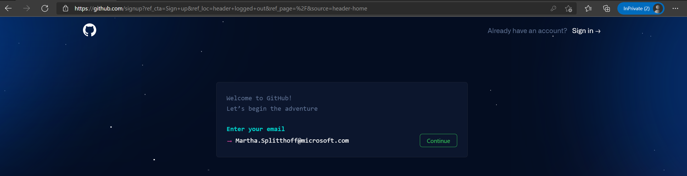

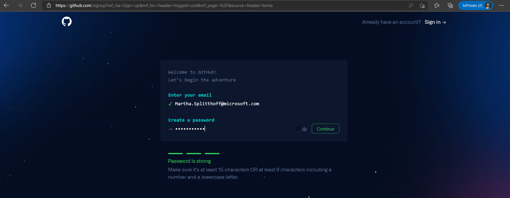

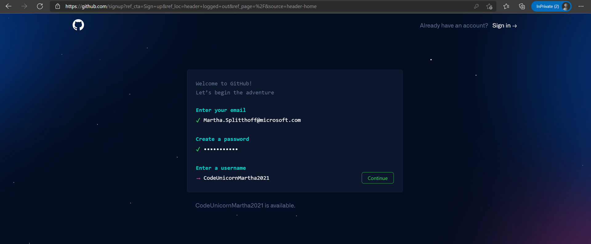

- Type **y** for receiving emails from GitHub about new product updates and announcements. Or **n** for not receiving emails from Github about product updates and announcements.
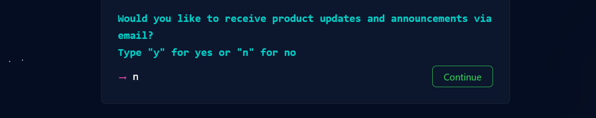

- To **verify** the account, please follow the instructions.
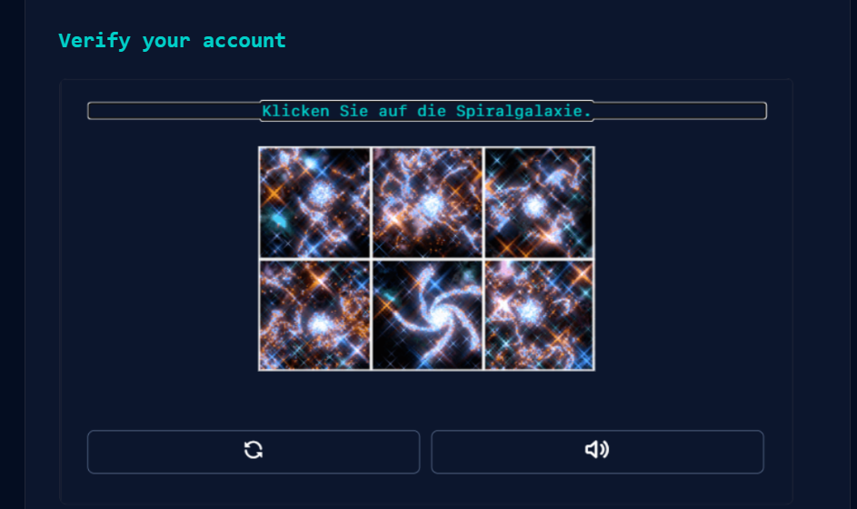

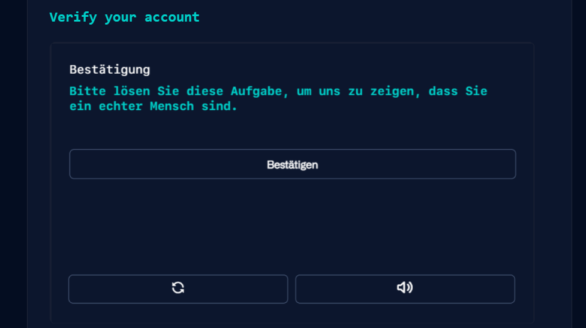

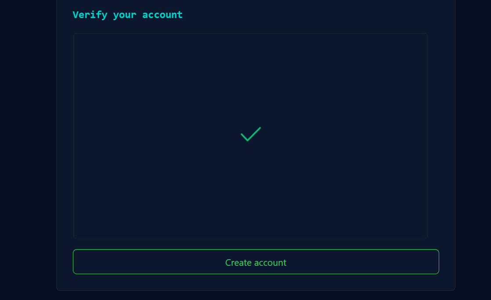

## Edit your GitHub Profile

### Upload a profile picture and insert your name

This is the front page of your account. This overview shows everything about your activities on GitHub, such as your contributions to repositories, your own repositories, your achievements and much more.
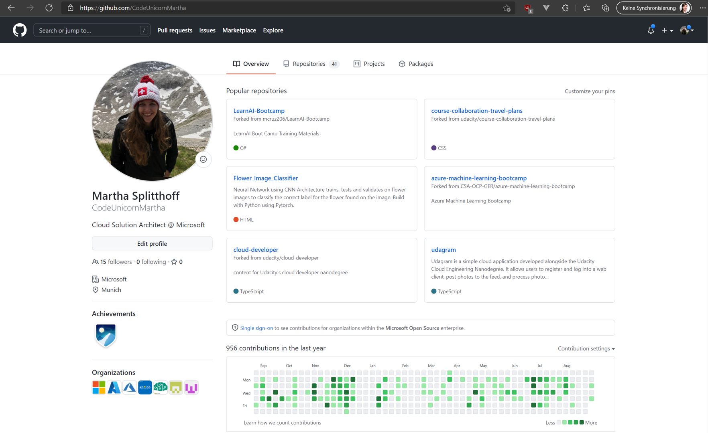

To change or add any of your information, click on your icon in the top right corner and choose **Settings**.
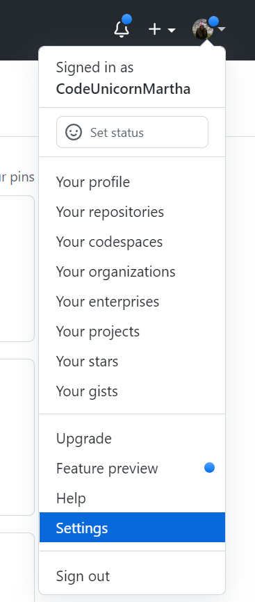

- Click on **Profile** and add your public information.

## Fork Repository

A Fork is a copy of a repository. This is extremely handy, if you want to freely experiment without making any changes to the original project. 
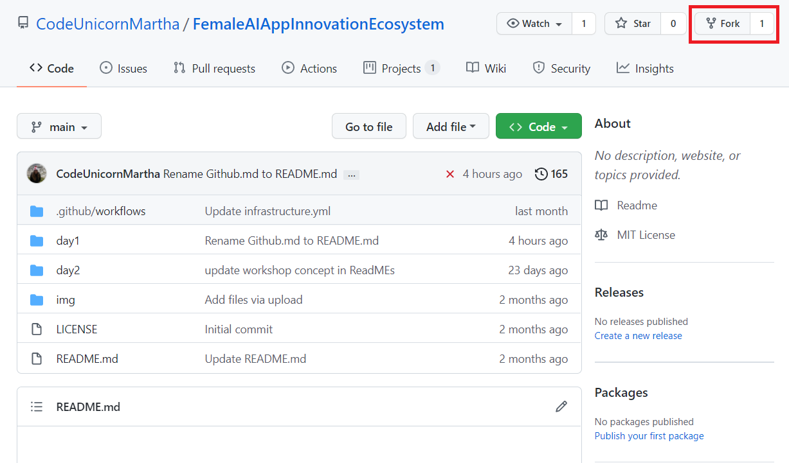

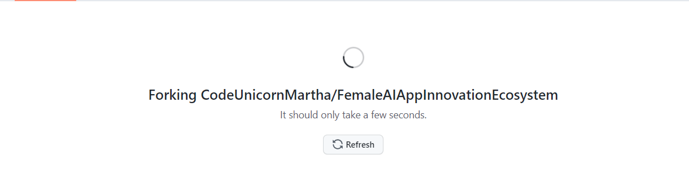

:::tip
📝
  - Link1
  - Link2
:::

[🔼 Day 1](../../README.md) | [Next challenge ▶](../Application/README.md)
