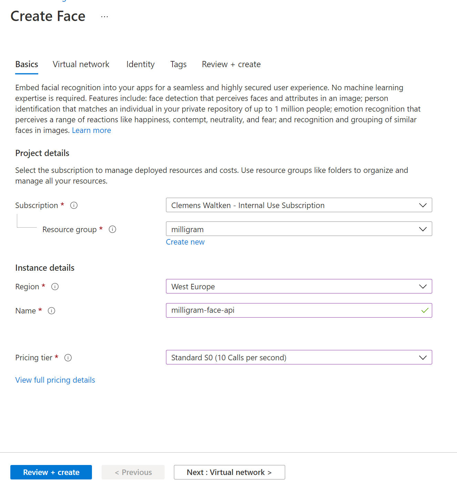
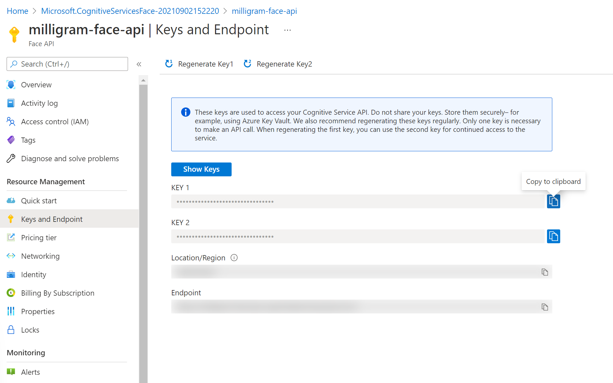

# Gesichtserkennung

⏲️ _geschätzte Zeit: 30 min._ ⏲️

## Das wirst du lernen 🎯

In dieser Aufgabe lernst du:

- wie man einen Face-API-Dienst in Azure erstellt
- wie du den Face API Service mit deiner App verbindest
- wie man den API-Schlüssel mit GitHub Secrets an seine App weitergibt
- wie man ein Selfie macht 😉.

API - Anwendungsprogrammierschnittstelle: Ein Software-Vermittler, der es zwei Apps ermöglicht, miteinander zu kommunizieren\_

### Weitere Ressourcen:

- [Was ist eine Ressource / Ressourcengruppe / Abonnement?](https://docs.microsoft.com/azure/cloud-adoption-framework/govern/resource-consistency/resource-access-management)
- [Face API](https://azure.microsoft.com/services/cognitive-services/face/)
- [Regionen und Availability Zones in Azure](https://docs.microsoft.com/azure/availability-zones/az-overview)
- [Github verschlüsselte Geheimnisse](https://docs.github.com/en/actions/reference/encrypted-secrets)

## Inhaltsverzeichnis

## Erste Schritte

Der erste Schritt bei der Erstellung unserer Face-API besteht darin, eine neue Ressource zu erstellen.

\_Azure Ressource: In Azure bezieht sich der Begriff Ressource auf eine Entität, die von Azure verwaltet wird. Zum Beispiel werden virtuelle Maschinen, virtuelle Netzwerke und Speicherkonten als Azure-Ressourcen bezeichnet.

- Klick auf das **+ Ressource erstellen** auf der Hauptseite
- Wähl die Kategorie **"KI + Machine Learning "**.
- Erstell einen **Gesichtserkennung**-Service.
  

## Gesicht erstellen Kognitiver Service

- Wähle dein **Abonnement**.
- Wähle die selbe **Ressourcengruppe** wie zuvor
- Wähl _Westeuropa_ als **Region** aus(Standort des Rechenzentrums, in dem der Service bereitgestellt wird)
- Erstell einen **eindeutigen Namen** und wähl die **Standard S0 Preisstufe**.
  
- Klick auf **Überprüfen + erstellen** und dann auf **Erstellen**

## Face Service Credential in GitHub Secrets integrieren

Der API-Schlüssel ist eine eindeutige Kennung, die wir in unseren Code einfügen. Auf diese Weise können wir unseren Code mit der API verbinden und API-Aufrufe durchführen.

- Navigiere zu deinem _Gesichtserkennungsdienst_ und da zu _Schlüssel und Endpunkt_ im Azure Portal
- Kopiere dir den _Schlüssel_ und den _Endpunkt_ in einen Editor.
  

In _Action Secrets_ kannst du verschlüsselte Variablen speichern, die du in einer Organisation, einem Repository oder einem Repository-Environment erstellst. Diese Geheimnisse können in GitHub-Aktions-Workflows verwendet werden.

- Navigiere zu den _Settings_ deines Repositorys in GitHub, dann zu _Secrets_ und _Actions_.
- Klick auf _New repository secret_
- Setz den Namen auf `VUE_APP_FACE_API_ENDPOINT`
- Setz den Wert auf den Endpunkt deines FACE-Service: https://xxxxxxx.cognitiveservices.azure.com/
- Füge das Geheimnis hinzu
  
  

- Lege ein weiteres _New repository secret_ an
- Setz den Namen auf `VUE_APP_FACE_API_KEY`
- Setz den Wert auf den Schlüssel deines FACE-Services. Das sollte eine Reihe aus Zahlen und Buchstaben sein.
- Füge das Geheimnis hinzu
  
  

## Führ die Frontend-Pipeline erneut aus

- Navigiere erneut zu den _Actions_, dann zu dem _pages_ Workflow und lasse den Workflow noch einmal ausführen.

- Warte einen Moment bis der Workflow durchgelaufen ist und klick dann auf den Frontend-Link, der unter dem Deploy-Schritt in deiner Pipeline angezeigt wird: `https://<DeinGithubHandle>.github.io/...`

Unsere Frontend-Anwendung sollte nun einen neuen Button mit einem Selfie-Symbol 🤩 haben, mit dem wir Selfies machen und schätzen können, wie alt wir sind.
Diese Selfies werden **nicht** gespeichert und **nicht** in der Timeline oder im News Feed angezeigt.

## Mach Selfies! Wie alt bist du wirklich? Spiel herum!

Mach also mindestens 5 Selfies und sag uns, wie alt du auf allen Fotos bist.

Mach auch Fotos von Leuten, die um dich herum sind, und schätze ihr Alter, du könntest sie überraschen. 😁

Das war's für heute! Herzlichen Glückwunsch! 🥳🙏

Jetzt werden wir unserer Milligram Social Media App beibringen zu verstehen, wenn wir mit ihr sprechen 🗣️.

## Zu viel? Wir haben die Lösung für dich!

Frag deinen Coach, wenn du nicht fertig geworden bist. Wir haben ein Back-up für dich. ⚠️

### Verwende den vorbereiteten Milligram Backend Service

Sieh dir die vorbereitete App mit unseren Bildern an, damit du mit [Milligram](https://codeunicornmartha.github.io/FemaleAIAppInnovationEcosystem/#/?stack-key=a78e2b9a) herumspielen kannst.

_Tipps 📝_

> - [Machine Learning in 5 Schwierigkeitsgraden](https://youtu.be/5q87K1WaoFI)

[◀ vorherige Challenge](../../day1/Application/DE_README.md) | [🔼 Home](../../README.md) | [nächste Challenge ▶](../Speech/DE_README.md)
