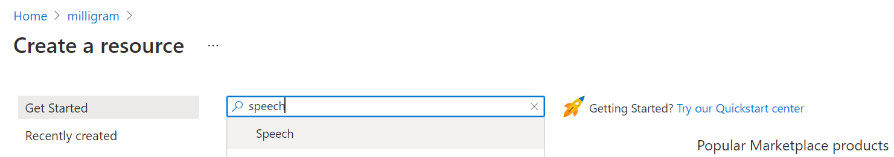

# Speech Recognition

⏲️ _est. time to complete: 30 min._ ⏲️

## Here is what you will learn 🎯

In this challenge you will learn how to:

- how to create a Face API service in Azure
- how to connect you Face API service with your App
- how to pass the API key to you App using Github Secrets
- how to take a selfie 😉

## Table of contents

## Getting started

- Navigate to the **Resource Group** we created during the "Face" challenge
- Create a **new resource** and search for **speech**

## Create Speech Cognitive Service

- Create the new resource and set the values as in the screenshot

- Similar to the "Face" challenge, copy the key to store it in **Github Secrets**

## Integrate Speech Service Credential into Github Secret

## Run Frontend Pipeline again

- Now navigate to **Actions** > **pages** and **Re-run all jobs**

## Talk to me! What do you have to say? Play around!
