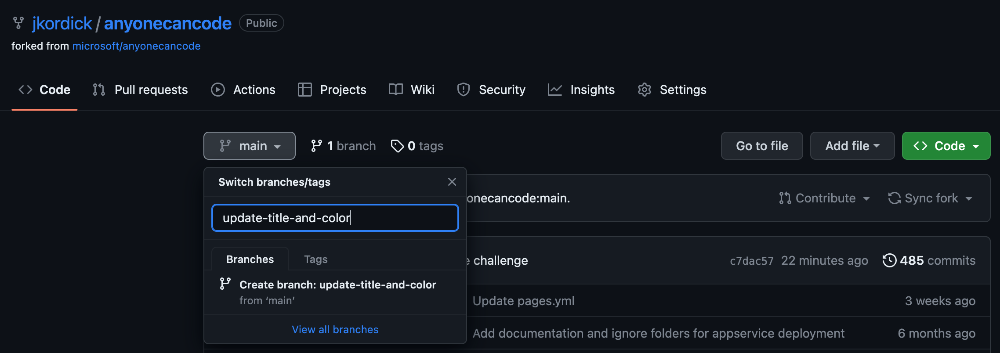
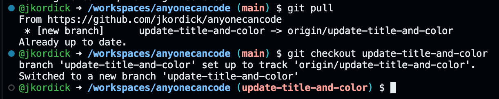
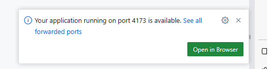
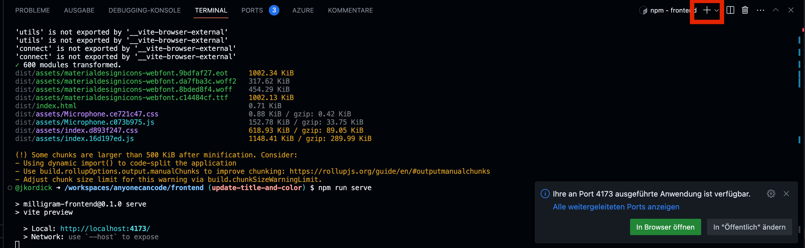
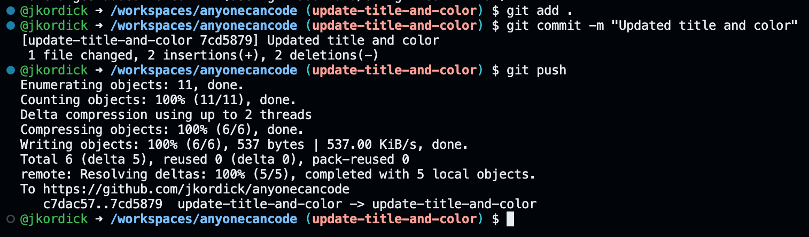
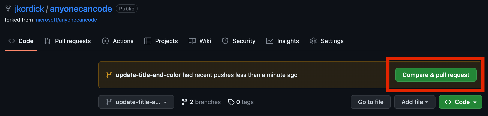
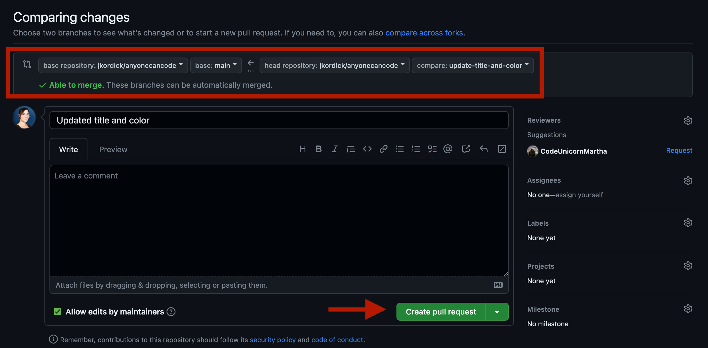
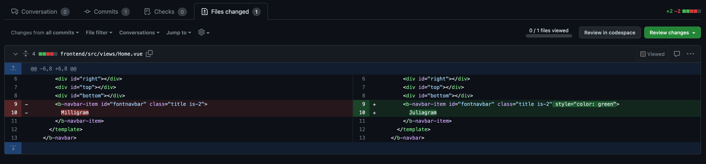

# Challenge 2: Make your first code changes and merge your first pull request

⏲️ _Est. time to complete: 60 min._ ⏲️

## Here is what you will learn 🎯

Today you will learn how to:

- Create a new branch in your project
- How to change the title and it's color of your App
- Test your changes in your codespace
- Commit & push your changes
- Open a pull request & merge it

## Table Of Contents

1. [Create a new branch in your project](#create-a-new-branch-in-your-project)
2. [Change the title and it's color of your App](#change-the-title-and-its-color-of-your-app)
3. [Test your changes in your codespace](#test-your-changes-in-your-codespace)
4. [Commit & push your changes](#commit--push-your-changes)
5. [Open a pull request and merge it](#open-a-pull-request-and-merge-it)

## Create a new branch in your project

Go to your repository on GitHub. Click on the "main" dropdown and type in the name of your new branch (e.g., Update-title-and-color). Click on 'Create branch: update-title-and-color' to create it.

Go back into your codespace and type into the terminal:
    
    git pull

and afterwards:

    git checkout update-title-and-color

It should look similar to this:

Congrats! You just created a new branch and switched to it successfully. Now you can start making changes to your code!

## Change the title and it's color of your App

Open the file **Home.vue** from the folder **frontend/src/views**. On top you find a so called `<template>` that describes the basic structure of the Home-View. To change the title of your App from Milligram however you like, you need to change the text between the `<b-navbar-item>` tags.

To change the color we need to add a new attribute to the `<b-navbar-item>` tag. The attribute is called `style` and we can set it to `color: green` to make our title green. You can find a full list of all possible colors [here](https://htmlcolorcodes.com/color-names/).

## Test your changes in your codespace 

1. Install recommended extensions when prompted.
2. In the terminal, navigate to the frontend folder with `cd frontend`
3. Run `npm install` to install node packages.
4. Build the app with this command - `npm run build`
5. Run the app - `npm run serve`
6. Click *browse to site* when it pops up to see the deployed test site - you should now see your changes!

## Commit & push your changes

Click on the `+` sign on the upper right of your terminal to create a new one. We do not want to stop our app from running, so we will use a new terminal for the next steps.

After verifying your changes, it's time to commit and push. At first we want to check which files we have changed. Type `git status` into your terminal and press enter. As we have only made changes in our **Home.vue** file, we can see that it is marked as modified.

Now run first `git add .` what will add all changed files to the staging area. Afterwards run `git commit -m "Update title and color"` to commit your changes. The `-m` flag is used to add a commit message. It is important to add a meaningful commit message, so that others can understand what you have changed. Afterwards run `git push` to push your changes to GitHub.

## Open a pull request and merge it

Now go back into your GitHub repository. You should see a message that you have pushed your branch. Click on the **Compare & pull request** button to open a new pull request. 

A new window will open. Here you can see your last commit message as a title and have the possibilty to insert a description. Check that you have chosen your own repositories main branch for the merge. 

Click on the **Create pull request** button on the lower left to create a new pull request.

> **Note**
> Please check that you open the pull request against the main branch of your own repository as shown in the screenshot below!

Another window opens. Here you can review your changes again. Click on **Files changed**. You can see the changes we have made in the **Home.vue** file.

Click back on **Conversation** to see the conversation view. Here you can see the commit message and the description we have added.

Pull requests are a very popular way of working professionally together with other developers on a project to ensure code quality. Usually another person would now review your changes and then (hopefully) accept them and merge them into the **main** branch. 
Today we will do this ourselves. Click on the **Merge pull request** and then **Confirm merge** button to merge your recent made changes.

If everything went well, you should see a message that your pull request has been merged. 

Congratulations! You have successfully made your first changes to your project, learned how professional developers work together and merged them into the main branch. 

[◀ Previous challenge](../GitHub/README.md) | [🔼 Home](../../../README.md) | [Next challenge ▶](../ApplicationPart2/README.md)
