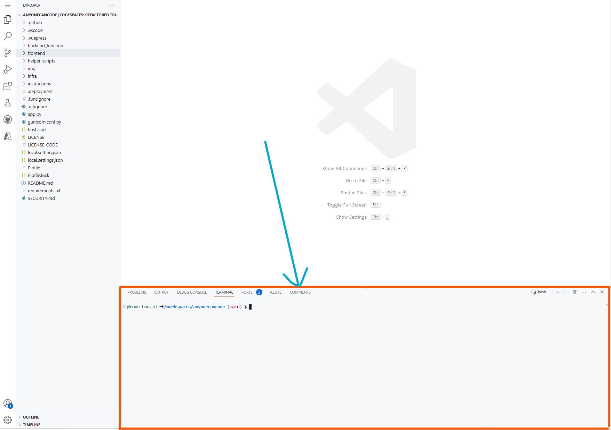

# Défi 2 : Faites vos premières modifications de code et fusionnez votre première demande de tirage

⏲️ _Temps estimé pour terminer : 60 min._ ⏲️

## Voici ce que vous allez apprendre 🎯

Aujourd'hui, vous allez apprendre comment :

- Créer une nouvelle branche dans votre projet
- Comment changer le titre et sa couleur de votre application
- Tester vos modifications dans votre espace de code
- Valider & pousser vos modifications
- Ouvrir une demande de tirage & la fusionner

## Table des matières

1. [Créer une nouvelle branche dans votre projet](#créer-une-nouvelle-branche-dans-votre-projet)
2. [Changer le titre et sa couleur de votre application](#changer-le-titre-et-sa-couleur-de-votre-application)
3. [Tester vos modifications dans votre espace de code](#tester-vos-modifications-dans-votre-espace-de-code)
4. [Valider & pousser vos modifications](#valider--pousser-vos-modifications)
5. [Ouvrir une demande de tirage et la fusionner](#ouvrir-une-demande-de-tirage-et-la-fusionner)

## Créer une nouvelle branche dans votre projet

Allez sur votre dépôt sur GitHub. Cliquez sur le menu déroulant "main" et tapez le nom de votre nouvelle branche (par exemple, Update-title-and-color). Cliquez sur 'Créer la branche : update-title-and-color' pour la créer.

Tapons quelques commandes git dans le terminal pour créer une nouvelle branche.

Qu'est-ce qu'un terminal ?

Vous avez probablement l'habitude de faire les choses sur votre ordinateur en déplaçant votre souris et en cliquant sur des choses. Il existe en fait une autre manière dont vous pouvez utiliser votre ordinateur : le terminal ! Au lieu de déplacer votre souris, vous pouvez taper une commande dans le terminal et l'ordinateur l'exécutera. Disons que vous voulez aller dans un dossier spécifique sur votre ordinateur - nous avons une commande pour cela, à savoir `cd <chemin-vers-votre-dossier>` (cd signifie change directory). Il existe de nombreuses autres commandes qui peuvent faire beaucoup de choses différentes. Nous appelons l'ensemble de toutes les commandes et de leurs combinaisons le langage de script Shell. Vous pouvez les essayer par vous-même, allez dans le terminal (la petite boîte comme montré sur la photo) et tapez `help` - cela listera toutes les commandes intégrées. N'hésitez pas à jouer avec et à les essayer pour vous familiariser avec l'environnement. Pour quelques commandes communes pratiques, vous pouvez essayer : `pwd` (affiche le chemin de votre répertoire courant, pwd signifie print working directory) et `ls` (liste tous les fichiers dans le dépôt courant)

Revenez dans votre espace de code et tapez dans le terminal :

    git pull

et ensuite :

    git checkout update-title-and-color

Cela devrait ressembler à ceci :

Félicitations ! Vous venez de créer une nouvelle branche et de passer dessus avec succès. Maintenant, vous pouvez commencer à apporter des modifications à votre code !

## Changer le titre et sa couleur de votre application

Ouvrez le fichier `Home.vue` du dossier `frontend/src/views`. En haut, vous trouverez un soi-disant `<template>` qui décrit la structure de base de la vue d'accueil. Pour changer le titre de votre application de Milligram comme vous le souhaitez, vous devez changer le texte entre les balises `<b-navbar-item>`.

Pour changer la couleur, nous devons ajouter un nouvel attribut à la balise `<b-navbar-item>`. L'attribut s'appelle `style` et nous pouvons le définir sur `color: green` pour rendre notre titre vert. [Vous pouvez trouver une liste complète de toutes les couleurs possibles ici.](https://htmlcolorcodes.com/color-names/)

## Tester vos modifications dans votre espace de code

1. Installez les extensions recommandées lorsqu'elles sont proposées.
2. Dans le terminal, naviguez vers le dossier frontend avec `cd frontend`
3. Exécutez `npm install` pour installer les packages node.
4. Construisez l'application avec cette commande - `npm run dev`
5. Cliquez sur _naviguer vers le site_ lorsqu'il apparaît pour voir le site de test déployé, vous devriez maintenant voir vos modifications
6. Maintenant, essayez de changer la couleur du titre pour une autre couleur de votre choix : la couleur changera automatiquement dans le navigateur sans que vous ayez à rafraîchir la page !

| :warning: Dépannage          |
|:---------------------------|
| si la pop-up `ouvrir dans le navigateur` n'apparaît pas en bas de votre fenêtre, actualisez la page et réessayez |

## Valider & pousser vos modifications

Cliquez sur le signe `+` en haut à droite de votre terminal pour en créer un nouveau. Nous ne voulons pas arrêter notre application, nous utiliserons donc un nouveau terminal pour les prochaines étapes.

Après avoir vérifié vos modifications, il est temps de les valider et de les pousser. Tout d'abord, nous voulons vérifier quels fichiers nous avons modifiés. Tapez `git status` dans votre terminal et appuyez sur entrée. Comme nous n'avons fait des modifications que dans notre fichier **Home.vue**, nous pouvons voir qu'il est marqué comme modifié.

Maintenant, exécutez d'abord `git add .` cela ajoutera tous les fichiers modifiés à la zone de staging. Ensuite, exécutez `git commit -m "Mise à jour du titre et de la couleur"` pour valider vos modifications. Le flag `-m` est utilisé pour ajouter un message de commit. Il est important d'ajouter un message de commit significatif, afin que les autres puissent comprendre ce que vous avez changé. Ensuite, exécutez `git push` pour pousser vos modifications sur GitHub.

## Ouvrir une demande de tirage et la fusionner

Retournez maintenant dans votre dépôt sur GitHub. Vous devriez voir un message indiquant que vous avez poussé votre branche. Cliquez sur le bouton **Comparer & demande de tirage** pour ouvrir une nouvelle demande de tirage.

> Si ce message n'apparaît pas, cliquez sur l'onglet **Demandes de tirage** puis sur le bouton **Nouvelle demande de tirage**.

Une nouvelle fenêtre s'ouvre. Ici, vous pouvez voir votre dernier message de commit comme titre et avez la possibilité d'insérer une description. Vérifiez que vous avez choisi la branche principale de votre propre dépôt pour la fusion.

Cliquez sur le bouton **Créer une demande de tirage** en bas à gauche pour créer une nouvelle demande de tirage.

> **Note**
> Veuillez vérifier que vous ouvrez la demande de tirage contre la branche principale de votre propre dépôt comme le montre la capture d'écran ci-dessous !

Une autre fenêtre s'ouvre. Ici, vous pouvez revoir vos modifications. Cliquez sur **Fichiers modifiés**. Vous pouvez voir les modifications que nous avons apportées dans le fichier **Home.vue**.

Cliquez à nouveau sur **Conversation** pour voir la vue de la conversation. Ici, vous pouvez voir le message de commit et la description que nous avons ajoutés.

Les demandes de tirage sont une manière très populaire de travailler professionnellement avec d'autres développeurs sur un projet pour garantir la qualité du code. Habituellement, une autre personne examinerait maintenant vos modifications et les accepterait puis les fusionnerait dans la branche **main**.
Aujourd'hui, nous allons le faire nous-mêmes. Cliquez sur le bouton **Fusionner la demande de tirage** puis sur le bouton **Confirmer la fusion** pour fusionner vos modifications récentes.

Si tout s'est bien passé, vous devriez voir un message indiquant que votre demande de tirage a été fusionnée.

Félicitations ! Vous avez réussi à apporter vos premières modifications à votre projet, vous avez appris comment les développeurs professionnels travaillent ensemble et vous les avez fusionnées dans la branche principale.

[◀ Défi précédent](../GitHub/README_FR.md) | [🔼 Accueil](../../../README_FR.md) | [Prochain défi ▶](../ApplicationPart2/README_FR.md)