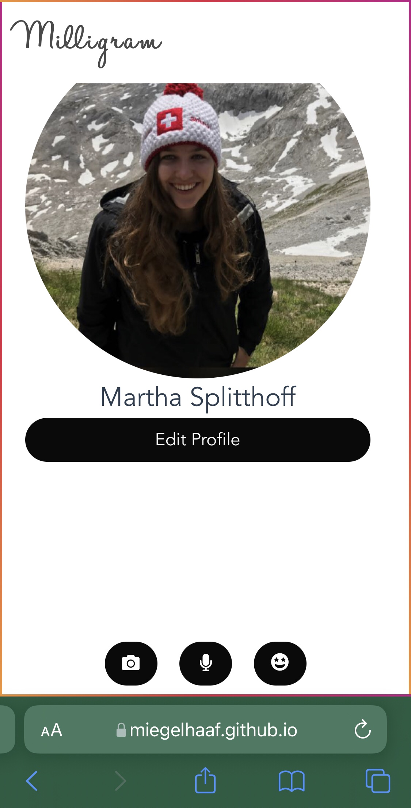
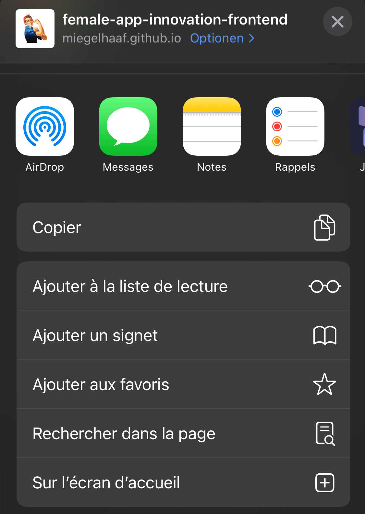
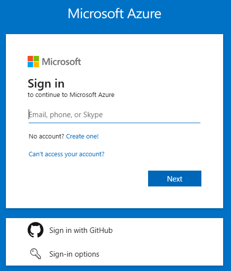
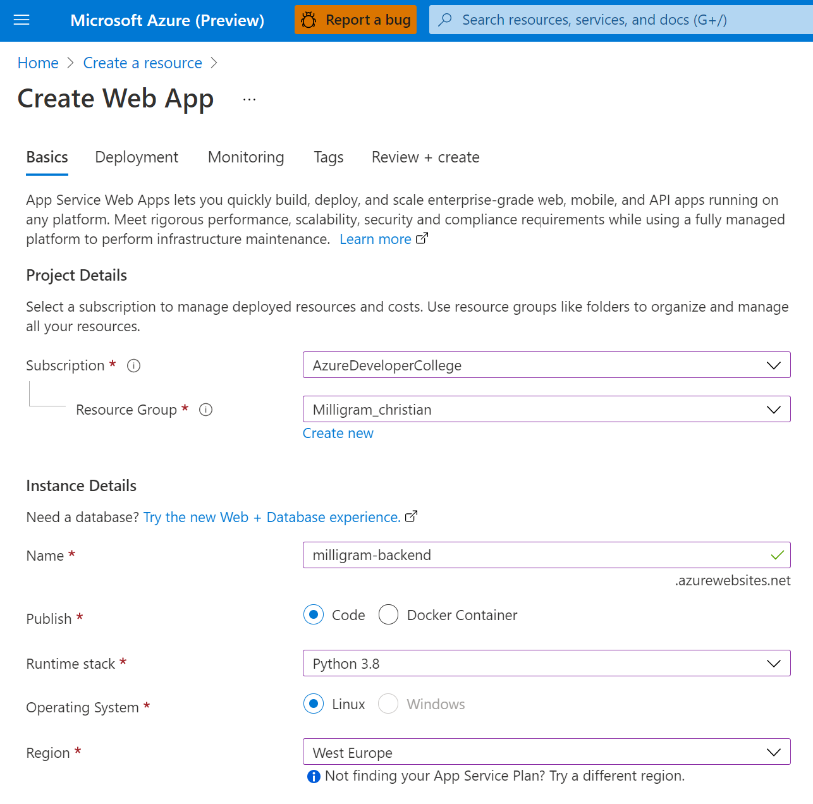
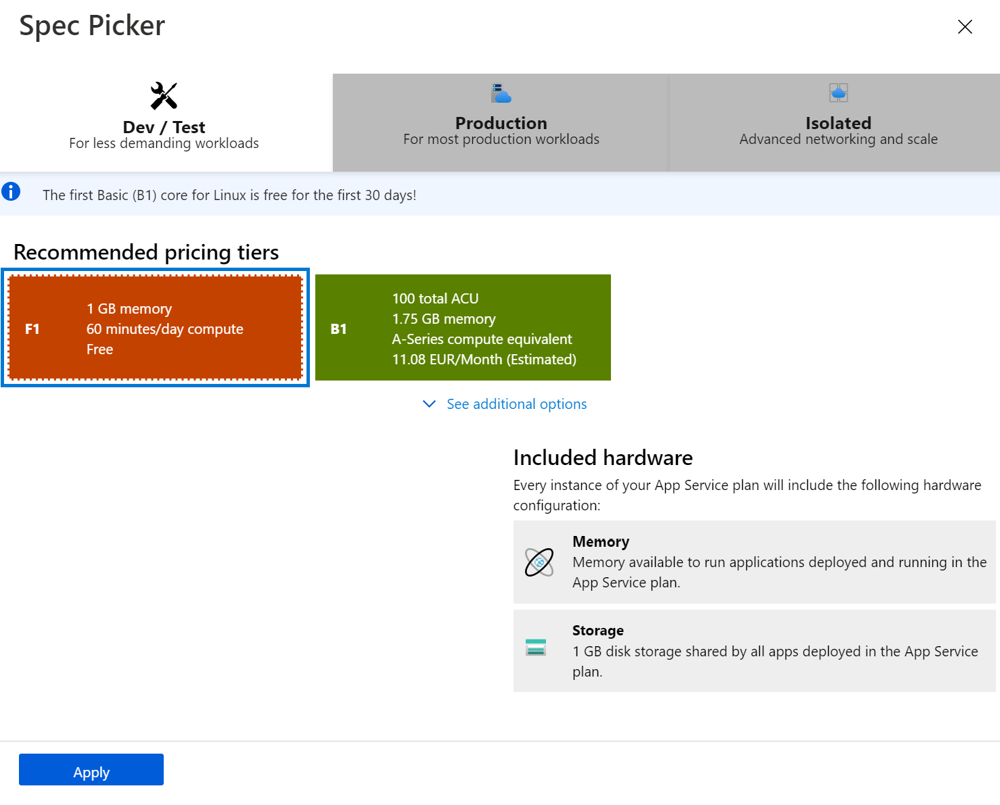
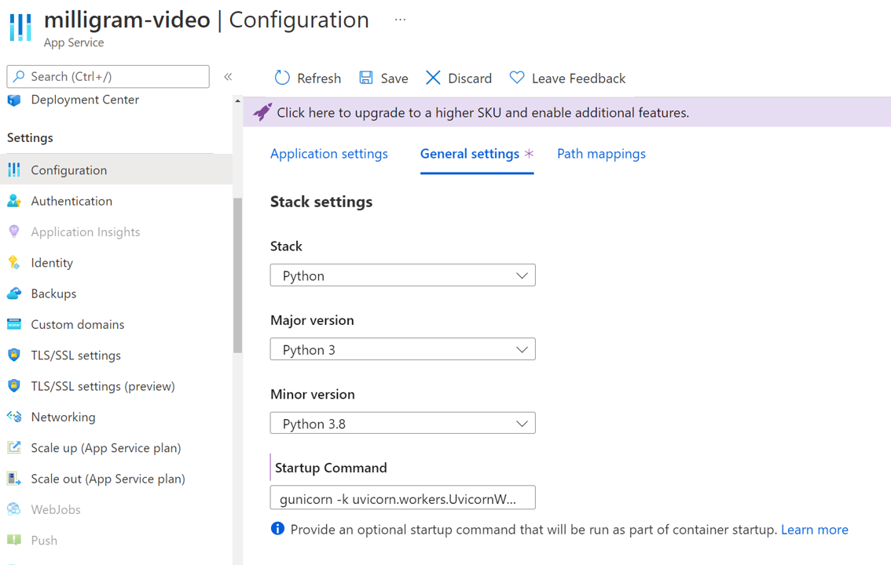
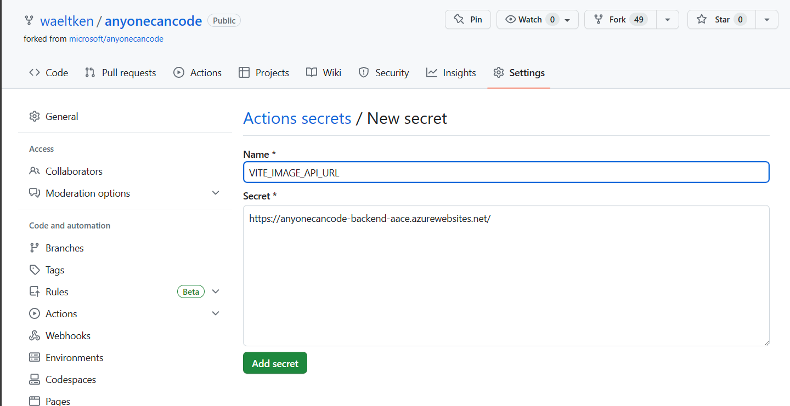
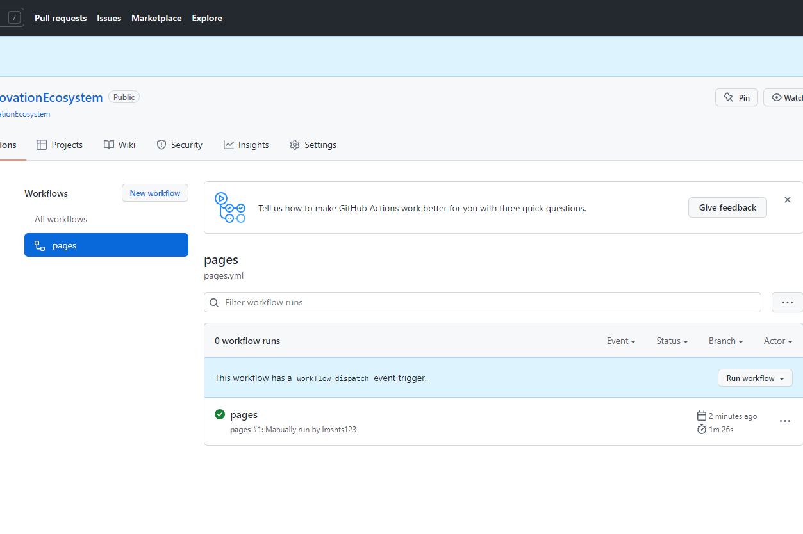

# Challenge 3: Create Milligram application on Azure

⏲️ _Est. time to complete: 60 min._ ⏲️

## Here is what you will learn 🎯

Today you will learn how to:

- Get started with GitHub Actions
- Deploy the Milligram frontend to GitHub Pages
- Create a Python web app on Azure
- Deploy the Milligram backend on Azure with GitHub Actions

## Table Of Contents

1. [Milligram application frontend](#milligram-application-frontend)
   1. [Enable GitHub Actions](#enable-github-action)
   2. [Run GitHub Actions](#run-github-action)
   3. [Enable GitHub Pages in project settings](#enable-github-page-in-project-settings)
   4. [Open GitHub Page on your phone](#open-github-page-on-your-phone)
   5. [Add application to home screen](#add-application-to-home-screen)
2. [Milligram application backend](#milligram-application-backend)
   1. [Prepare image upload](#prepare-image-upload)
   2. [Make application backend run in the cloud](#make-application-backend-run-in-the-cloud)
   3. [Deploy image upload](#deploy-image-upload)
3. [Overcharged? We got you covered](#overcharged-we-got-you-covered)

### Further informative resources

- [What are GitHub Actions?](https://github.com/features/actions)
- [GitHub Actions Documentation](https://docs.github.com/actions)
- [What is a repository?](https://docs.github.com/github/creating-cloning-and-archiving-repositories/creating-a-repository-on-github/about-repositories)
- [What is a Resource / Resource Group / Subscription?](https://docs.microsoft.com/azure/cloud-adoption-framework/govern/resource-consistency/resource-access-management)

## Milligram application frontend

First, let's get started with the frontend application - The part that you will
see and use on your mobile phone or your web browser. This is the main way to
interact with Milligram's services.

What does frontend mean?

Let's imagine a simple car. Everything you see - the seats, the roof, the floor, the user interface (dashboard, steering wheel, etc.) - that's all **frontend**.
Then you open the hood: and there it is! The **backend** and the **API**. You can see the engine, the transmission and some other elements.

But how to understand this example now... quite simple. The **frontend** is what the user uses to give instructions to the **backend** via an **API**. So when you step on the gas pedal, the engine accelerates.

_Stepping on the gas pedal triggers a request in the frontend to the API in the backend for the engine to accelerate, and the required part of the backend (in this case, the engine) executes it._

### Enable GitHub Actions

We've prepared an automated way to create and update the website for you. You will use two of GitHub's awesome features. GitHub Pages and GitHub Actions. Let's get started with the actions.

- Go to your repository's **Actions**
- Click the button which says _I understand my workflows, go ahead and enable them_ to enable GitHub Actions

_A [repository](https://docs.github.com/github/creating-cloning-and-archiving-repositories/creating-a-repository-on-github/about-repositories) contains all of your project's files and each file's revision history. You can discuss and manage your project's work within the repository._

Make sure that the Actions have read/write permissions. Check this via Settings->Actions->General and scroll down to the *Workflow permissions* section. Click the *Read and write permissions* option. Click *Save*.

### Run GitHub Actions

- In the **Actions** tab of your repository, click on the **pages** workflow.
- Open the **Run Workflow** dropdown and click the **Run Workflow** button to confirm the workflow execution.

Now, observe how the workflow is being run and take a look at the individual steps that are run for you by GitHub.

### Enable GitHub Pages in project settings

To be able to display the website (frontend) we've built and deployed using
GitHub Actions, we need to enable GitHub Pages for your repository. GitHub
Pages are an easy way to display a static website related to your repository.
Many people use it to display the documentation for their projects. We will use
it to serve the frontend for Milligram.

- Go to your repository settings-
  
- Navigate to **Pages**, select the branch _gh-pages_ and hit the save button.
  
- The deployment will take 1-2 minutes. After that, the Milligram website is
  accessible through `https://<your github username>.github.io/anyonecancode/`.

Take a look at the website. Try changing the profile to your GitHub account name
and see that it is stored even if you refresh the browser.

### Open GitHub Page on your phone

Milligram is a fun little app similar to photo based social media that you might
be familiar with. Of course we want to use it on our mobile phones so we can use
the cameras to take awesome selfies and pictures for Milligram. Its main
features are:

- Display simple GitHub account information from your own profile
- Take photos and add them to the stream of images
- Detect objects within images and create image descriptions (implemented on day 2)
- Transcribe sentences you speak using Azure Speech Service (implemented on day 2)

To make the first modifications, open your personal Milligram website on your phone and explore it's content. Then edit the profile in the app to show your own GitHub profile picture in the app.

### Add The application to your homescreen

On modern mobile phones, you can "install" web apps on you homescreen to make them
more accessible and make them look more like an app from an official
appstore. Therefore, we will not add the app to our phones' homescreen.

- Open the browser menu to add the website to your homescreen.
  - This is how it should look like on ios:
    
  - This is how it should look on Android:
    
- Now you can open the website like a normal app from the homescreen of your phone.

## Milligram application backend

The application backend will receive uploaded photos, store them for us and return them when needed.

Our application can be divided into a frontend (something you see and runs locally on your phone) and a backend (something which processes your information). In this case, as we want to create our own social media application, we need pictures to be stored for our "News Feed". That means we need a place to store many files and a place to run our application logic (which is our programming code).

To store the files, we will use an "Azure Storage Account" and to run our application, we will use an "Azure Web App".
First things first - sign into your "Azure Account".

### Log Into Azure

- Go to your browser and visit [portal.azure.com](https://ms.portal.azure.com/?l=en.en-us#home).

- Log in with `your Azure Account`. The login information is provided to you by your trainer. Ask them if you don't know where to find it.

### Create Storage Account

Our storage account is the place where we "save" our pictures for our news feed.
Inside the storage account we use the so called [Azure Blob Storage](https://learn.microsoft.com/en-us/azure/storage/blobs/). The Blob Storage can hold a massive amount of files.
Just like the disk or storage on your computer. A cool fun fact is that you can store as many photos on the storage account as you like and you don't have to worry about your storage space.

> **Azure Resource**: In Azure, the term resource refers to an entity managed by Azure. For example, virtual machines, virtual networks,
> and storage accounts are all referred to as Azure resources.

> **Azure Resource Group**: A resource group is a container that holds related resources for an Azure solution. The resource group can include all the
> resources > for the solution, or only those resources that you want to manage as a group.

- Go to the home page of the Azure Portal.
- Click on _+ Create a resource_.
- Search for _Storage Account_ and click _Create_.
- Select your subscription & the resource group with the name that you used to log into the Azure Portal.
- The name of your Azure Storage account needs to be globally unique. It also has to use small letters and no special characters.
- Make sure to select `Standard` for _Performance_ and `Locally-redundant storage (LRS)` for _Redundancy_.
  
- Hit _Review & create_ and after that _Create_ to finish creating the storage account.
- Once the storage account is created there should be a button _Go to resource_. Click on it.
- Now you should see your storage account. Select _Containers_ on the left hand side.
- Click the _New Container_ button and create a container named `images`. Leave everything in the preconfigured settings as is.

This is the place where all uploaded images to our Milligram app will be stored.

### Create Web App

Our [Azure Web App](https://learn.microsoft.com/en-us/azure/static-web-apps/) is a computer managed by Microsoft where you can easily run your own application without worrying about software updates, security issues, backUp or hardware issues (as you might have already experienced on your phone).

- Go to the home page of the Azure Portal again.
- Click on _+ Create a resource_ as you did before.
- Search for _Web App_ and click _Create_.
- Select your subscription & your Resource Group.
- Make sure to adjust the settings according to the image below:
  - Name: `<pick your own unique name>`
  - Publish: `Code`
  - Runtime stack: `Python 3.8`
  - Operating System: `Linux`
  - Region: `West Europe`
    
- Create a new App Service Plan and `<pick your own name>`.
  
- Click on _Change size_ and then click the _Dev/Test_ tab and select the **F1** which is free, otherwise you might be charged when creating a larger plan.
  
- Click _Review + Create_ at the bottom of the screen.
- Review the displayed information and click _Create_ on the next screen to spin up the backend application.

:::tip
📝 On the review page, you can find information about the estimated costs of your service. Make sure it displays _Estimated price - Free_
:::

### Integrate storage and configure Web App

Now let's connect our application with our storage so that you can take pictures on your phone and store them. We need to tell the Web application where it can find our storage service. The application can take external configurations to configure the connection to the storage account.

- For this reason navigate to your _storage account_ again. You should be able to find it via the search bar in the top either by searching its unique name or just storage account.
- Under _Access keys_ you can find the _Connection string_ from our storage account. Hit the 👀*Show keys* button so are able to copy it's value to e.g. a notepad.
 
- Navigate back to the web app and open the _Configuration_ tab, click _New connection string_ and create a new connection string with the following settings:
  - Name: `STORAGE`
  - Value: `<paste your (earlier copied) connection string from Storage Account>`
  - Type: `Custom`
- Hit `ok` and `Save`.
- Navigate and scroll down to the _CORS_ tab on the left hand side of your app service and enter `https://<YourGithubHandle>.github.io` under _Allowed Origins_.
- Hit `Save` again.

Now your storage account and web app are successfully connected and can communicate with each other.

### Azure Web App configuration

There is still a small configuration missing. Our app uses a ready-made module so that users can interact with their content. But this module is not installed yet. In order for it to be installed, we provide the web app with a configuration that is executed when the app is launched, allowing users to interact with our app's data.

- Navigate to **_Configuration_** under _Settings_.
- Under the tab **_General settings_** you should find the _Stack settings_. For our backend we are working with the programming language Python - more specifically Python 3.8.
- Behind **_Startup Command_** enter `gunicorn -k uvicorn.workers.UvicornWorker` and hit _Save_.
  

### Deploy Milligram backend code to Azure Web App via GitHub Actions

To ensure our social media application can actually do something, we need to bring our source code to the Azure Web App. To do that we will automate this so called "deployment". Hence, we don't have to rely on a manual process every time we want to make changes (e.g. changing the title of the application) to our application and thus, we avoid many mistakes.

- Navigate to the _Deployment Center_ tab on the left hand side of your Web App in the Azure portal.
- Under the _Settings_ tab select _GitHub_ as _Source_ and click _Authorize_.
- Under _Organization_ select your GitHub handle and under _Repository_ select `anyonecancode` as well as the `main` _Branch_.
- Hit `Save`.

Once you have hit `Save` the service automatically creates a workflow file in your GitHub repository. This workflow is immediately being executed and after about 2 minutes your web app is ready. You can also check your deployment on your "Actions" tab in your repository. The color green is always a good sign.

### Check if Milligram app is running correctly

Let's pause a second. To make sure that you are on track, test if our app's frontend gets a response from our backend service. Before we bring everything together, we want to make sure the backend service is working as expected.

- Navigate to the _Overview_ tab on the left hand side of the Web App Service.
 
- Hit the _URL_ and test the website using the docs to figure out if the features of our Milligram will work.
- In your browser you will have the following view:
 

  :::tip
  📝 If you want to learn more about Swagger have a look at [Wikipedia](<https://en.wikipedia.org/wiki/Swagger_(software)>).
  :::

- Select the _GET/images_ endpoint, hit `Try it Out` and then hit `Execute`. Once you get the 200 Response code, you have a successful running service. Congratulations!

  :::tip
  📝 Look at the HTTP Response Codes at [Wikipedia](https://en.wikipedia.org/wiki/List_of_HTTP_status_codes). 2xx Codes generally mean success, where as 4xx and 5xx Codes show different kinds of errors. You probably know 404 - Not Found.
  :::

### Integrate Azure Web App URL in GitHub Secrets

Now that we are sure that our backend service works as expected, we can bring everything together.

To do this, we will use a GitHub feature called _Secrets_, where you can store your backend URL to make your frontend talk to the backend service.

- On your Repository page in GitHub select _Settings_ and navigate to _Secrets_ > _Actions_.
- Add a _New repository secret_ named `VITE_IMAGE_API_URL` and as value set `<your WebApp's URL>`.
  > ⚠️⚠️ Your URL should end on a **/**. It should look like this: `https://xxxx.azurewebsites.net/`

### Run frontend Pipeline again

For the change of adding the secret taking effect in the frontend, we need to run our build pipeline again so that the process can pickup the newly created setting.

- Navigate to the _Actions_ tab, select the _pages_ workflow and rerun the workflow:
  

- Once the workflow is started you will see the workflow running. You can get to the view below by clicking on the workflow run.
  
- Finally finishing up the Milligram Service.
  

### Open the App - Take a Selfie and review your News Feed

Click on the frontend link displayed under the deploy step under your pipeline `https://<yourGithubHandle>.github.io/...` or reopen the App on your phone.

Our frontend application should now have a new button with a camera symbol that allows us to take pictures. These pictures should then appear on the timeline or news feed.

So go ahead and take at least 5 pictures and make sure they appear in your app. Make sure to share them with at least 1-2 friends so they can also upload their photos to your News Feed.

That's a wrap for today. Congrats!

Tomorrow, we will make our app smart by adding artificial intelligence to it for detecting objects within your images as well as talking to our app.

## Overcharged? We got you covered

Ask your coach if you did not succeed. We have you covered with a back up.

### Use prepared Milligram backend Service

Look at the prepared application with our pictures for you to play around [Milligram](https://codeunicornmartha.github.io/FemaleAIAppInnovationEcosystem/#/?stack-key=a78e2b9a).

[◀ Previous challenge](../ApplicationPart1/README.md) | [🔼 Home](../../../README.md) | [Next challenge ▶](../../day2/Vision/README.md)
