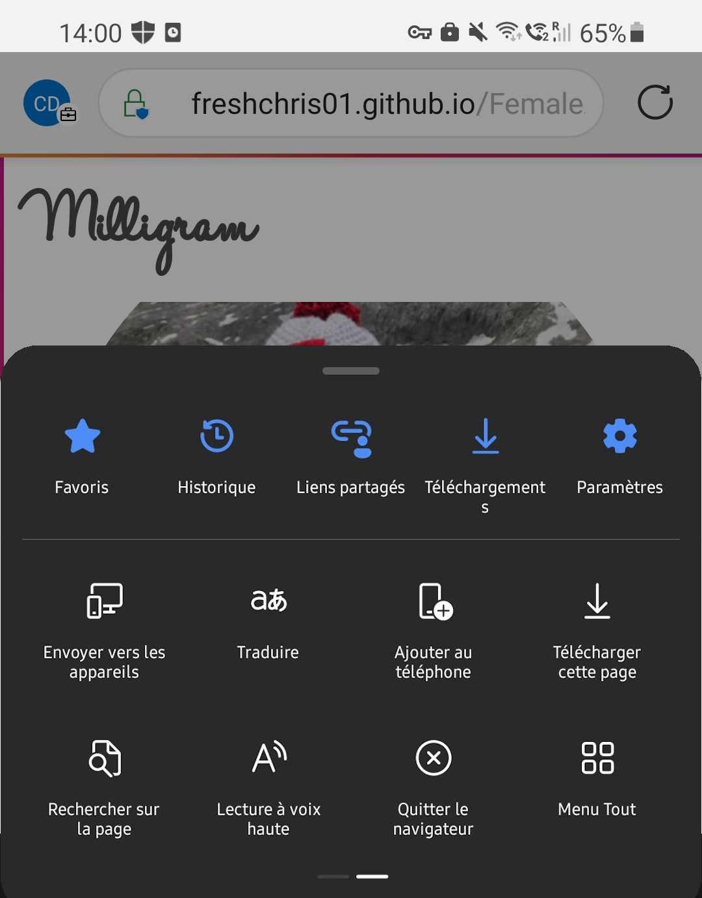
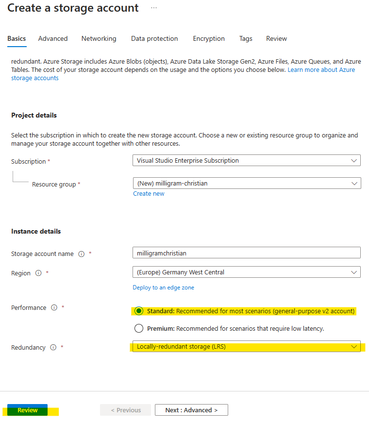

# Défi 3 : Créer une application Milligram sur Azure

⏲️ _Temps estimé pour terminer : 60 min._ ⏲️

## Voici ce que vous allez apprendre 🎯

Aujourd'hui, vous allez apprendre comment :

- Commencer avec GitHub Actions
- Déployer le frontend de Milligram sur GitHub Pages
- Créer une application Web Python sur Azure
- Déployer le *backend* de Milligram sur Azure avec GitHub Actions

## Table des matières

1. [Frontend de l'application Milligram](#frontend-de-lapplication-milligram)
  1. [Activer GitHub Actions](#activer-github-actions)
  2. [Exécuter GitHub Actions](#exécuter-github-actions)
  3. [Activer GitHub Pages dans les paramètres du projet](#activer-github-pages-dans-les-paramètres-du-projet)
  4. [Ouvrir GitHub Page sur votre téléphone](#ouvrir-github-page-sur-votre-téléphone)
  5. [Ajouter l'application à l'écran d'accueil](#ajouter-lapplication-à-lécran-daccueil)
2. [Backend de l'application Milligram](#backend-de-lapplication-milligram)
  1. [Préparer le téléchargement de l'image](#préparer-le-téléchargement-de-limage)
  2. [Faire fonctionner le backend de l'application dans le cloud](#faire-fonctionner-le-backend-de-lapplication-dans-le-cloud)
  3. [Déployer le téléchargement de l'image](#déployer-le-téléchargement-de-limage)
3. [Surfacturé ? Nous avons ce qu'il vous faut](#surfacturé-nous-avons-ce-quil-vous-faut)

### Ressources informatives supplémentaires

- [Qu'est-ce que GitHub Actions ?](https://github.com/features/actions)
- [Documentation de GitHub Actions](https://docs.github.com/actions)
- [Qu'est-ce qu'un dépôt ?](https://docs.github.com/github/creating-cloning-and-archiving-repositories/creating-a-repository-on-github/about-repositories)
- [Qu'est-ce qu'une Ressource / Groupe de ressources / Abonnement ?](https://docs.microsoft.com/azure/cloud-adoption-framework/govern/resource-consistency/resource-access-management)

## Frontend de l'application Milligram

Tout d'abord, commençons par l'application frontend - Il s'agit de la partie que vous verrez et utiliserez sur votre téléphone mobile ou votre navigateur web. C'est le principal moyen d'interagir avec les services de Milligram.

Que signifie frontend ?

Imaginons une simple voiture. Tout ce que vous voyez - les sièges, le toit, le sol, l'interface utilisateur (tableau de bord, volant, etc.) - c'est tout le **frontend**.
Puis en ouvrant le capot vous aurez accès aux éléments restant: Le **backend** et l'**API** (le moteur, la transmission etc...)

Le **frontend** est ce que l'utilisateur utilise pour donner des instructions au **backend** via une **API**. Dans notre exemple, lorsque vous appuyez sur la pédale d'accélérateur, le moteur accélère.

_Appuyer sur la pédale d'accélérateur déclenche une demande du frontend (pédale) au backend (moteur) via l'API (la transmission) pour que le moteur accélère_

### Activer GitHub Actions

Vous avez préparé une manière automatisée de créer et de mettre à jour le site web pour vous. Vous utiliserez deux des fonctionnalités géniales de GitHub. GitHub Pages et GitHub Actions. Commençons par les actions.

- Allez dans l'onglet **Actions** de votre dépôt
- Cliquez sur le bouton vert qui dit _I understand my workflows, go ahead and enable them_ pour activer GitHub Actions:

Assurez-vous que les Actions ont des permissions de lecture/écriture. Vérifiez cela via **Paramètres** -> **Actions** -> **Général** et descendez jusqu'à la section **Workflow Permissions**. Cliquez sur l'option **Read and write permissions**. Cliquez sur **Save**.

### Exécuter GitHub Actions

- Dans l'onglet **Actions** de votre dépôt, cliquez sur le workflow **pages**.
- Ouvrez le menu déroulant **Run workflow** et cliquez sur le bouton **Run workflow** pour confirmer l'exécution du workflow.

Maintenant, observez comment le workflow est exécuté et jetez un œil aux étapes individuelles qui sont exécutées pour vous par GitHub.

### Activer GitHub Pages dans les paramètres du projet

Pour pouvoir afficher le site Web (frontend) que vous avez construit et déployé en utilisant GitHub Actions, vous devez activer GitHub Pages pour votre dépôt. GitHub Pages est une manière facile d'afficher un site Web (statique) lié à votre dépôt.
Beaucoup de gens l'utilisent pour afficher la documentation de leurs projets. Vous l'utiliserons pour servir le frontend pour Milligram.

- Allez dans l'onglet **Settings** de votre dépôt-
  
- Naviguez jusqu'à **Pages**, sélectionnez la branche _gh-pages_ et appuyez sur le bouton de sauvegarde.
  
- Le déploiement prendra 1 à 2 minutes. Après cela, le site web de Milligram est accessible via `https://<votre nom d'utilisateur github>.github.io/everyonecancode/`.

Jetez un œil au site web. Essayez de changer le profil par votre nom de compte GitHub et voyez qu'il est stocké même si vous actualisez la page.

### Ouvrez la page GitHub sur votre téléphone

Milligram est une petite application amusante similaire aux réseaux sociaux basés sur des photos que vous pourriez connaître. Bien sûr, vous voulez l'utiliser sur nos téléphones mobiles pour pouvoir utiliser
les caméras pour prendre des selfies et des photos géniales pour Milligram. Ses principales caractéristiques sont :

- Afficher certaines informations de votre compte GitHub sur votre profil
- Prendre des photos et les ajouter au fil d'actualité d'images
- Détecter des objets dans les images et créer des descriptions d'images (implémenté le jour 2)
- Transcrire les phrases que vous prononcez en utilisant Azure Speech Service (implémenté le jour 2)

Votre application est disponible. Mais il n'y a pas de stockage ou de base de données derrière. Donc, elle ne pourra pas stocker de données. Vous mettrez cela en place lors de l'étape suivante.

Maintenant, pour faire les premières modifications, ouvrez votre site web personnel Milligram sur votre téléphone et explorez son contenu. Ensuite, modifiez le profil dans l'application pour afficher votre photo de profil GitHub dans l'application.

### Ajoutez l'application à votre écran d'accueil

Sur les smartphones récents, vous pouvez "installer" des applications web sur votre écran d'accueil pour les rendre plus accessibles et leur donner l'apparence d'une application d'un store officiel (Apple Store / Google Play). Pour se faire:

- Ouvrez le menu du navigateur pour ajouter le site Web à votre écran d'accueil.
  - Voici à quoi cela devrait ressembler sur iOS :
    
  - Voici à quoi cela devrait ressembler sur Android :
    
- Maintenant, vous pouvez ouvrir le site Web comme une application normale depuis l'écran d'accueil de votre téléphone.

## Backend de l'application Milligram

Le backend de l'application recevra les photos téléchargées, les stockera pour vous et les transmettra au frontend lorsque nécessaire.

Notre application peut être divisée en un frontend (quelque chose que vous voyez et qui s'exécute localement sur votre téléphone) et un backend (quelque chose qui traite vos informations et qui s'exécute sur un serveur). Dans ce cas, comme vous voulez créer notre propre application de réseaux sociaux, vous avez besoin de photos pour notre "Fil d'actualités". Cela signifie que vous avez besoin d'un endroit pour stocker de nombreux fichiers et d'un endroit pour exécuter notre logique d'application (qui est votre code).

Pour stocker les fichiers, vous utiliserez un "Compte de stockage Azure" et pour exécuter notre application, vous utiliserez une "Application web Azure".
Tout d'abord, connectez-vous à votre Compte Azure.

### Se connecter à Azure

- Allez sur votre navigateur et visitez [portal.azure.com](https://ms.portal.azure.com).

- Connectez-vous avec `votre compte Azure`. Les informations de connexion vous sont fournies par votre formateur. Demandez-lui si vous ne savez pas où les trouver.

### Créer un compte de stockage

Notre compte de stockage est l'endroit où vous sauvegardez nos photos pour notre fil d'actualités.
À l'intérieur du compte de stockage, vous utiliserez un [Azure Blob Storage](https://learn.microsoft.com/en-us/azure/storage/blobs/). 
Tout comme le disque dur de votre ordinateur, le Blob Storage peut contenir une quantité massive de fichiers. Un point intéressant est que vous pouvez stocker autant de photos sur le compte de stockage que vous le souhaitez et vous n'avez pas à vous soucier de votre espace de stockage.

> **Ressource Azure** : Dans Azure, le terme ressource fait référence à une entité gérée par Azure. Par exemple, les machines virtuelles, les réseaux virtuels, et les comptes de stockage sont tous appelés ressources Azure.

> **Groupe de ressources Azure**: Un groupe de ressources est un "dossier" qui contient des ressources liées à un projet sur Azure.

- Allez à la page d'accueil du portail Azure.
- Cliquez sur **+ Créer une ressource**.
- Recherchez **Storage Account** et cliquez sur **Create**.
- Sélectionnez votre abonnement et le groupe de ressources avec le nom que vous avez utilisé pour vous connecter au portail Azure.
- Le nom de votre compte de stockage Azure doit être unique à l'échelle mondiale. Il doit également utiliser des petites lettres et aucun caractère spécial.
- Assurez-vous de sélectionner `Standard` pour **Performance** et `Locally-redundant storage (LRS)` pour **Redundancy**.
  
- Cliquez sur _Review_ puis sur _Create_ pour terminer la création du compte de stockage.
- Une fois le compte de stockage créé, il devrait y avoir un bouton _Go to resource_. Cliquez dessus.
- Vous devriez maintenant voir votre compte de stockage. Sélectionnez _Containers_ sur le côté gauche.
- Cliquez sur le bouton _New Container_ et créez un conteneur nommé `images`. Laissez tout dans les paramètres préconfigurés tels quels.

C'est l'endroit où toutes les images téléchargées sur notre application Milligram seront stockées.

### Créer une application Web

Notre [Azure Web App](https://learn.microsoft.com/en-us/azure/static-web-apps/) est un ordinateur géré par Microsoft où vous pouvez facilement exécuter votre propre application sans vous soucier des mises à jour logicielles, des problèmes de sécurité, des sauvegardes ou des problèmes matériels (comme vous avez peut-être déjà expérimenté sur votre téléphone).

- Retournez à la page d'accueil du portail Azure.
- Cliquez sur **+ Créer une ressource** comme vous l'avez fait précédemment.
- Recherchez **Web App** et cliquez sur **Create**.
- Sélectionnez votre abonnement et votre groupe de ressources.
- Assurez-vous d'ajuster les paramètres selon l'image ci-dessous :
  - Nom : `<choisissez votre propre nom unique>`
  - Publier : `Code`
  - Pile d'exécution : `Python 3.8`
  - Système d'exploitation : `Linux`
  - Région : `West Europe`
    
- Créez un nouveau plan de service App et `<choisissez votre propre nom>`.
  
- Dans le menu déroulant du plan tarifaire, sélectionnez **Free F1** qui est gratuit, sinon vous pourriez être facturé en créant un plan plus grand.
- Cliquez sur **Review + Create** en bas de l'écran.
- Revoyez les informations affichées et cliquez sur **Create** sur l'écran suivant pour lancer l'application backend.

> 📝 Sur la page de révision, vous pouvez trouver des informations sur le coût estimé de votre service. Assurez-vous qu'il affiche **Estimated price - Free**"

### Intégrer le stockage et configurer l'application Web

Maintenant, connectons notre application à notre stockage afin que vous puissiez prendre des photos sur votre téléphone et les stocker. Vous devez indiquer à l'application Web où elle peut trouver notre service de stockage. L'application peut prendre des configurations externes pour configurer la connexion au compte de stockage.

- Pour cela, naviguez à nouveau vers votre _Storage account_. Vous devriez pouvoir le trouver via la barre de recherche en haut soit en recherchant son nom unique, soit simplement en recherchant le compte de stockage.
- Sous **Access keys**, vous pouvez trouver la **Connection string** de notre compte de stockage. Cliquez sur le bouton **Show keys** pour pouvoir copier sa valeur, par exemple, dans un bloc-notes.
  
- Revenez à l'application web et ouvrez l'onglet _Configuration_, cliquez sur _New connection string_ et créez une nouvelle chaîne de connexion avec les paramètres suivants :
  | Chaîne de connexion | Type | Valeur |
  |-|-|-|
  | `STORAGE` | Custom | `<collez votre chaîne de connexion (copiée plus tôt) du Storage Account>` |
- Cliquez sur `ok` et `Save`.
- Naviguez et descendez jusqu'à l'onglet **CORS** sur le côté gauche de votre service d'application et entrez `https://<YourGithubHandle>.github.io` sous _Allowed Origins_.
- Cliquez à nouveau sur `Save`.

> CORS (Cross Origin Resource Sharing): Est une mesure de sécurité qui empèche le frontend d'un site web de communiquer avec le backend d'un autre sauf autorisation spéciale.

Maintenant, votre compte de stockage et votre application web sont correctement connectés et peuvent communiquer entre eux.

### Configuration de l'application Web Azure

Il manque encore une petite configuration. Notre application utilise un module prêt à l'emploi pour que les utilisateurs puissent interagir avec leur contenu. Mais ce module n'est pas encore installé. Pour qu'il soit installé, vous fournissez à l'application web une configuration qui est exécutée lorsque l'application est lancée, permettant aux utilisateurs d'interagir avec les données de notre application.

- Naviguez vers **Configuration** sous _Settings_.
- Sous l'onglet **General settings**, vous devriez trouver les **Stack settings**. Pour notre backend, vous travaillez avec le langage de programmation Python - plus précisément Python 3.8.
- Derrière **Startup Command**, entrez `gunicorn -k uvicorn.workers.UvicornWorker` et cliquez sur **Save**.
  

### Déployer le code backend de Milligram sur Azure Web App via GitHub Actions

Pour que notre application de réseaux sociaux puisse réellement faire quelque chose, vous devez amener notre code source sur l'application Web Azure. Pour ce faire, vous automatiserez ce "déploiement". Ainsi, vous n'avzez pas à compter sur un processus manuel chaque fois que vous voulez apporter des modifications (par exemple, changer le titre de l'application) à notre application et ainsi, vous évitez de nombreuses erreurs.

- Naviguez vers l'onglet _Deployment Center_ sur le côté gauche de votre application Web dans le portail Azure.
- Sous l'onglet **Settings**, sélectionnez **GitHub** comme **Source** et cliquez sur **Authorize**.
- Sous **Organization**, sélectionnez votre identifiant GitHub et sous **Repository**, sélectionnez votre depôt ainsi que la branche `main`.
- Cliquez sur **Save**.

Une fois que vous avez cliqué sur **Save**, le service crée automatiquement un fichier de workflow dans votre dépôt GitHub. Ce workflow est immédiatement exécuté et après environ 2 minutes, votre application web est prête. Vous pouvez également vérifier votre déploiement dans l'onglet "Actions" de votre dépôt. La couleur verte est toujours un bon signe.

### Vérifiez si l'application Milligram fonctionne correctement

Faisons une pause. Pour vous assurer que vous êtes sur la bonne voie, testez si le frontend de votre application obtient une réponse de votre service backend. Avant de tout rassembler, vous devez vous assurer que le service backend fonctionne comme prévu.

- Naviguez vers l'onglet **Overview** sur le côté gauche du Web App Service.
  
- Cliquez sur Domaine par défaut, ajoutez `/docs` à la fin, puis testez le site Web en utilisant la documentation interactive pour déterminer si les fonctionnalités de notre Milligram fonctionnent.
- Dans votre navigateur, vous aurez la vue suivante :
  

  > 📝 Si vous voulez en savoir plus sur OpenAPI, consultez [Wikipedia](<https://fr.wikipedia.org/wiki/OpenAPI_(logiciel)>).

- Sélectionnez le point de terminaison **GET/images**, cliquez sur `Try it Out` puis sur `Execute`. Une fois que vous obtenez le code de réponse 200, vous avez un service en cours d'exécution réussi. Félicitations !

  > 📝 Consultez les codes de réponse HTTP sur [Wikipedia](https://fr.wikipedia.org/wiki/Liste_des_codes_HTTP). Les codes 2xx signifient généralement le succès, tandis que les codes 4xx et 5xx indiquent différents types d'erreurs. Vous connaissez probablement 404 - NOT FOUND.

### Clarifications, qu'avons-nous fait jusqu'à présent ?

Félicitations, vous venez de déployer le backend de votre application web ! Résumons ce que vous avez fait jusqu'à présent.

D'abord, vous avez déployé le frontend (interface utilisateur) de notre application Web en utilisant les pages github. C'est ce que vous voyez lorsque vous allez sur votre lien de pages GitHub. Le frontend avait besoin d'un serveur pour servir des images et exécuter une certaine logique. C'est là que la partie Azure est intervenue. 

Vous avez créé une ressource de stockage, elle est responsable du stockage de vos images. Ensuite, vous avez créé une ressource d'application Web, ici vous exécuterez votre logique de serveur. La logique du serveur est écrite en Python en utilisant un framework (boite à outil) appelé FastAPI. Le code de la logique du serveur est hébergé dans le dépôt GitHub de everyonecancode. 

Vous avez connecté l'application web au dépôt GitHub et vous avez demandé au serveur d'exécuter une commande spécifique lors du démarrage de l'application web. Cette commande commencera à exécuter notre logique de serveur, c'est pourquoi vous pouvez voir les docs dans votre navigateur sous `/docs`. Ensuite, vous essaierez de connecter le Frontend au Backend.

### Intégrer l'URL de l'application web Azure dans les secrets de GitHub

Maintenant que vous êtes sûrs que votre service backend fonctionne comme prévu, vous pouvez tout rassembler.

Pour ce faire, vous utiliserez une fonctionnalité de GitHub appelée **Secrets**, où vous pouvez stocker votre URL de backend pour faire parler votre frontend avec le service backend.

- Sur la page de votre dépôt dans GitHub, sélectionnez **Settings** et naviguez vers **Secrets and Variables** > **Actions**.
- Ajoutez un _New repository secret_ nommé `VITE_IMAGE_API_URL` et comme valeur mettez `<l'URL de votre WebApp>`.
  > ⚠️⚠️ Votre URL doit se terminer par un **/**. Elle devrait ressembler à ceci : `https://xxxx.azurewebsites.net/` > 

### Exécutez à nouveau le pipeline frontend

Pour que le changement d'ajout du secret prenne effet dans le frontend, vous devez exécuter à nouveau votre workflow de déploiement afin que le processus puisse récupérer le nouveau paramètre créé.

- Naviguez vers l'onglet **Actions**, sélectionnez le workflow **pages** et relancez le workflow :
  

- Une fois le workflow démarré, vous verrez le workflow en cours d'exécution. Vous pouvez accéder à la vue ci-dessous en cliquant sur l'exécution du workflow.
  
- Enfin, terminons le service Milligram.
  

### Ouvrez l'application - Prenez un selfie et consultez votre fil d'actualités

Cliquez sur le lien frontend affiché sous l'étape de déploiement sous votre pipeline `https://<votreNomGithub>.github.io/...` ou rouvrez l'application sur votre téléphone.

Votre application frontend devrait maintenant avoir un nouveau bouton avec un symbole de caméra qui vous permet de prendre des photos. Ces photos devraient ensuite apparaître sur la chronologie ou le fil d'actualités.

Alors allez-y et prenez au moins 5 photos et assurez-vous qu'elles apparaissent dans votre application. Assurez-vous de les partager avec au moins 1-2 amis pour qu'ils puissent également télécharger leurs photos sur votre fil d'actualités.

C'est tout pour aujourd'hui. Félicitations ! 🎉

## Vous coincez ? Nous avons ce qu'il vous faut

Demandez à votre coach si vous n'avez pas réussi. Nous avons une solution de secours pour vous.

### Utilisez le service backend Milligram préparé

Regardez l'application préparée avec nos photos pour que vous puissiez jouer [Milligram](https://codeunicornmartha.github.io/FemaleAIAppInnovationEcosystem/#/?stack-key=a78e2b9a).

[◀ Défi précédent](../ApplicationPart1/README_FR.md) | [🔼 Accueil](../../../README_FR.md) | [Prochain défi ▶](../../day1/ApplicationPart3/README.md)

