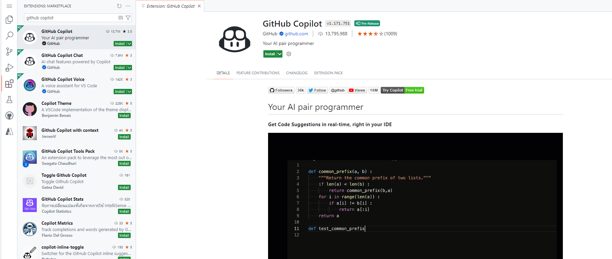
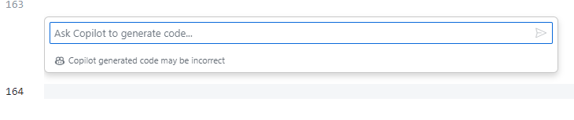
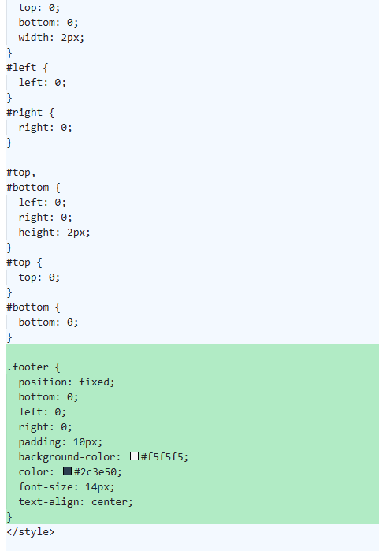
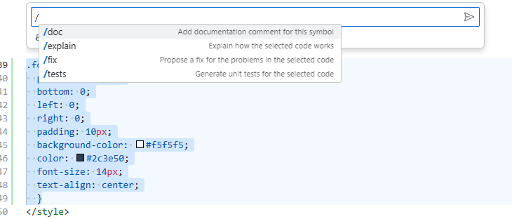

# Challenge 4: Github Copilot 

⏲️ Temps estimé pour terminer: 15 min._ ⏲️

## Voici ce que vous allez apprendre 🎯

Aujourd'hui, vous apprendrez à :

- Ajout GitHub Copilot à votre espace de travail
- Ajout d'un pied de page à l'application
- Générer du code avec Github Copilot
- Expliquer le code avec Github Copilot

## Table des matières

1. [Getting Started](#getting-started)
2. [Add a footer](#add-a-footer)
3. [Generate Code with Github Copilot](#generate-code-with-github-copilot)
4. [Explain Code with Github Copilot](#explain-code-with-github-copilot) 

### Autres ressources informatives

- [Qu'est ce que le CSS?](https://developer.mozilla.org/fr/docs/Web/CSS)
- [GitHub Copilot Documentation](https://docs.github.com/fr/copilot)

## Getting Started

In this challenge, we'll delve into refining our code by initiating a new pull request while exploring the capabilities of GitHub Copilot, an AI-driven coding assistant. Our aim is to integrate a footer into our application with the aid of this tool. Let's kickstart the process by integrating GitHub Copilot into our Codespace environment.

Here are the steps to follow:

1. Navigate to the extensions marketplace and search for GitHub Copilot.
2. Click on the "Install" button to add it to our environment.  

  

3. Verify the installation by testing its functionality: Open any file within the repository and, at any point in the code, press **Ctrl+I**. If a prompt appears for Copilot to generate code, then the installation is successfully completed!  

## Add a footer

A website footer is a section located at the bottom of a web page. It often contains links or copyright notices. Our goal is to incorporate this section into the application. Let's start this process by creating a new branch:

1. Within our Codespace environment, in the terminal type the command `git checkout -b add-footer`. This command will create a new branch named **add-footer** and automatically switch you to this newly created branch.
2. Navigate to the file located at **frontend > src > App.vue**.
3. Inside this file, locate the closing </transition> tag, you can find it at **line 11**. Beneath it, insert the following code snippet: ``<footer>Made with love ❤️</footer>``. This addition will integrate a footer section into our application.

Following what we learnt in our previous challenges, it's crucial to test our changes within the Codespace environment to ensure everything functions as expected. To do this:

1. In the terminal, change the directory to the frontend folder by executing ``cd frontend``.
2. run the command ``npm run dev`` to start the development server.
3. click on **Run in Browser** to launch the application in your preferred browser. Once loaded, scroll down to the bottom of the application interface and you should now be able to see the newly added footer.  

The current footer has some display issues which we will try to fix with github copilot!

## Generate code with Github Copilot

You might have noticed that the footer lacks any visual styling and that when you release the scroll bar, the footer quickly disappears back into the main section of the application. **Cascading Style Sheets (CSS)** is a fundamental language in web development used to manipulate the visual presentation of web pages, including elements like layout, colors, and fonts.

Now, let's consider the scenario where you're a developer who has no experience in working with CSS but still wants to enhance the appearance of the footer and wants to fix the scroll bar problem. This is where GitHub Copilot becomes incredibly useful!

1. Remove the line of code we added at line 12 ``<footer>Made with love ❤️</footer>``
2. Select all the code using **Ctrl+A** then press on **Ctrl+I**, write in the prompt bar **Please add a footer to this application that has the text  "Made with love ❤️"  and please add proper styling**
3. Copilot will generate code suggestions. Click on "Accept".  

  

4. re-run the application with ``npm run dev`` and view the page again, you should now see the footer with styling and the scrollbar problem should disappear.

| :warning: Warning          |
|:---------------------------|
| Github Copilot might generate different results for every participant. Please expect that your user interface might look different than the one shown in the picture. If you have any issues with the generated code, feel free to ask the instructors.   |

## Explain code with Github Copilot

GitHub Copilot serves as a great tool not only for coding but also for understanding unfamiliar sections of code. Its capabilities extend beyond simple code generation; it can assist with bug fixing, code documentation generation, and even test creation.

Now, let's delve into how GitHub Copilot explains code. Follow these steps:

1. Identify a section of code that presents a challenge or that you don't fully grasp, such as the ``.footer`` styling segment.
2. Press **Ctrl+I** and type **/explain**. This action triggers a list of commands, including **/tests**, **/fix**, and **/docs**.
3. Upon hitting enter, you'll see an explanation in the chat section of GitHub Copilot, located in the sidebar on the left. This chat interface allows you to interact with Copilot conversationally as long as you ask programming-related queries. Thus, it won't provide information on non-programming topics, such as where to purchase a new guitar.  

  

Before we move on to the next challenge, try engaging more with Copilot. Explore clarification on various sections of the code that may be interesting to you. Don't hesitate to experiment with different commands and leverage Copilot's capabilities to generate new code snippets. Each time you make a modification, make sure to test it to observe its impact on the application.

