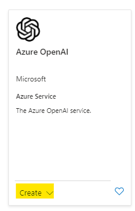
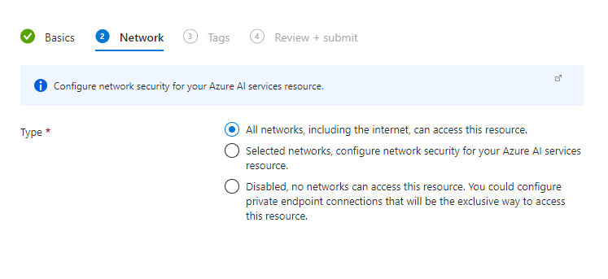
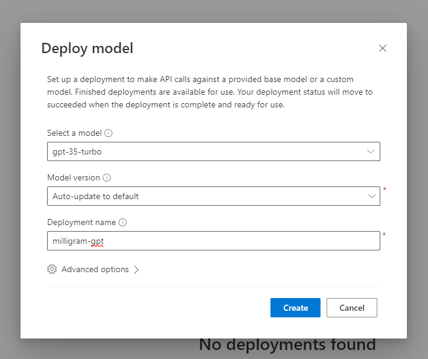
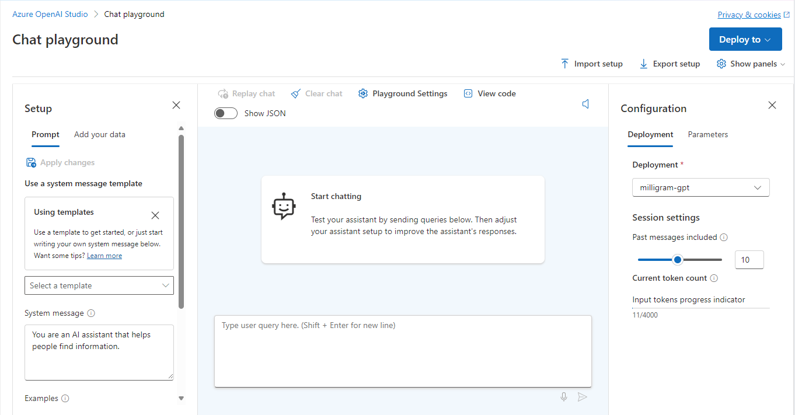

# Challenge 7: Chat Bot

⏲️ _est. time to complete: 30 min._ ⏲️

## Here is what you will learn 🎯

In this challenge you will learn how to:

- Create an OpenAI service in Azure
- Deploy an OpenAI model and connect it to your app
- Pass the API key to your app using GitHub Secrets
- Start chatting with model powered assistant in the app

## Table Of Contents

1. [Getting Started](#getting-started)
2. [Create OpenAI Azure service instance](#create-openai-azure-service-instance)
3. [Deploying openAI Large Language Model](#deploying-openai-large-language-model)
4. [Azure OpenAI credentials](#azure-openai-credentials)
5. [Run Frontend Pipeline again](#run-frontend-pipeline-again)

### Further informative resources

- [Azure OpenAI Documentation](https://learn.microsoft.com/en-us/azure/ai-services/openai/)


## Getting started
- Navigate to your **Resource Group** we created on Day 1 during the previous challenges again
- Create a new **Resource** and search for **Azure OpenAI**

    

## Create OpenAI Azure service instance

- Select **Azure OpenAI** and hit **Create**.
- Your subscription and resource group should already be set. Select **westeurope** as region and **Standard S0**.
- Give the resource a unique name.
- Hit **Next** and in network you should select "All networks, including the internet, can access this resource."
- Hit **Next** twice and create the resource
  
  

## Deploying openAI Large Language Model 
- Go to the Azure openAI resource you created and click on **Model deployments**
- Next, click on **Create new deployment** here we will choose the OpenAI model we want to deploy
- Select model **gpt-35-turbo** and model version **Auto-update to default**
- Give a unique name to your deployment name then click on create  

  

Congratulations! You just deployed an instance of the openAI gpt turbo model, we will later add this model to our Milligram app to build a chat bot. For now you can actually test it out inside azure and ask it a few questions. Go to the model you deployed and click on **Open in Playground**, there you can chat with the chat assistant. You can also change the parameters of the model under **Configuration > Parameters**
 


## Azure OpenAI credentials
In order to connect our user interface with the openAI model, we need to integrate the openAI credentials in the process. For this, there are 2 options. We can add our keys in the Azure web app (Option 1) or we can automate it by adding the keys in our github workflow.

### Option 1: Add OpenAI Azure credentials to web app
Go back to Azure and open the Milligram web app again:
- Go to **environment variables**  
- Create new variable with name **CHAT_API_KEY** and paste Key 1
- Create another variable with name **CHAT_API_ENDPOINT** and paste the endpoint url
- Finally create another variable with name **AZURE_OPENAI_MODEL_NAME** And paste the name you chose when you deployed the gpt turbo model.


### Option 2: Integrate OpenAI Azure credentials into GitHub Secret 
Similar to what we did in the challenges on Day 1 we now want to add the secret keys to Github 
- Go to the Azure openAI resource dashboard and click on **Keys and Endpoint**
- On Github Go to your repository, **Settings > Secrets and Variables > Actions** then click on **create new repository secret**
- Create new secret with name **CHAT_API_KEY** and paste Key 1
- Create another secret with name **CHAT_API_ENDPOINT** and paste the endpoint url
- Finally create another secret with name **AZURE_OPENAI_MODEL_NAME** And paste the name you chose when you deployed the gpt turbo model.

Now we also want to add the secrets to our github workflow:  

1. Add the following code snippet under `subscription-id` around line 74 in the file located at **.github/workflows/main_milligram.yml**
```
      - uses: azure/appservice-settings@v1
        with:
          app-name: 'milligram'
          slot-name: 'Production'  # Optional and needed only if the settings have to be configured on the specific deployment slot
          app-settings-json: '[{ "name": "CHAT_API_KEY", "value": "${{ secrets.CHAT_API_KEY }}", "slotSetting": false }, { "name": "CHAT_API_ENDPOINT", "value":  "${{ secrets.CHAT_API_ENDPOINT }}", "slotSetting": false }, { "name": "AZURE_OPENAI_MODEL_NAME", "value": "${{ secrets.AZURE_OPENAI_MODEL_NAME }}", "slotSetting": false }]'
        id: settings
```

## Run Frontend Pipeline again

- Navigate to **Actions** > **Pages** and **Run workflow**

Click on the frontend link displayed under the deploy step under your pipeline `https://<yourgithubhandle>.github.io/...` or open the app on your phone.

Our frontend application should now have a new button with a chat symbol that allows us to chat with our assistant. The assistant is powered by the model we deployed through the Azure OpenAI service. Have a chat with your bot 🎉