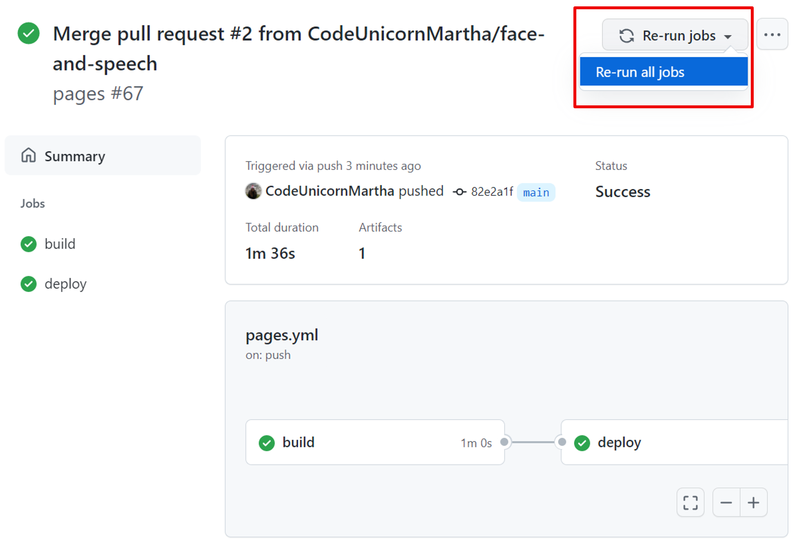

# Défi 6: Reconnaissance vocale

⏲️ _temps estimé pour terminer: 30 min._ ⏲️

## Voici ce que vous allez apprendre 🎯

Dans ce défi, vous apprendrez comment:

- Créer un service Azure : Speech API
- Connectez votre service Speech API avec votre application
- Transmettez la clé API à votre application à l'aide des variables secretes GitHub
- Dialoguer avec l'application

## Table des matières

### Ressources informatives supplémentaires

- [Qu'est-ce qu'une ressource / groupe de ressources / abonnement?](https://docs.microsoft.com/azure/cloud-adoption-framework/govern/resource-consistency/resource-access-management)
- [API de parole](https://azure.microsoft.com/services/cognitive-services/speech-services/#overview)
- [Régions et zones de disponibilité dans Azure](https://docs.microsoft.com/azure/availability-zones/az-overview)
- [Secrets chiffrés GitHub](https://docs.GitHub.com/en/actions/reference/encrypted-secrets)

## Commencer

- Utilisez le même service cognitif que vous avez créé dans le [défi Vision](../Vision/README_FR.md)

## Intégrer les informations d'identification du service Speech API dans les "secrets" GitHub

Encore une fois, vous devez partager les informations de cette ressource avec l'application Web, afin qu'elle puisse utiliser l'_intelligence_ du service Speech API. Par conséquent, nous allons créer un autre secret GitHub et le partager avec l'application.

- Naviguez vers GitHub > Paramètres > Secrets > Actions et ajoutez un `Nouveau secret de dépôt`.
- Nom: `VITE_SPEECH_API_KEY`
- Valeur: La clé de votre service Speech API que vous avez copiée auparavant
- Ajouter un secret.

  

Maintenant, nous allons faire comprendre à notre application quand nous parlons à notre application de médias sociaux Milligram.

## Exécutez à nouveau le pipeline Frontend

- Naviguez vers **Actions** > **Pages** et **Exécutez le workflow**
  
  

Cliquez sur le lien frontend (coté client) affiché sous l'étape de déploiement sous votre pipeline `https://<yourgithubhandle>.github.io/...` ou ouvrez l'application sur votre téléphone.

Notre application frontend (coté client) devrait maintenant avoir un nouveau bouton avec un symbole de microphone qui nous permet de parler à notre application en anglais et en allemand et d'avoir notre discours transcrit.

Ni ce que vous dites ni ce qui est transcrit ne sera sauvegardé et n'apparaîtra **pas** sur la chronologie ou le fil d'actualité.

## Parlez-moi! Que voulez-vous dire? Jouez autour

Alors allez-y et dites au moins 5 phrases et dites-nous à quel point votre application vous comprend bien.

Jetez également un œil à votre application ou demandez à d'autres personnes de parler à travers un téléphone, vous pourriez être surpris.

Par défaut, il ne comprendra que l'allemand et l'anglais, si vous voulez changer la langue, vous pouvez changer le repo dans `Frontend` > `scr` > `views` > `Microphone.vue` à la ligne 7 et ajouter par exemple l'ukrainien
`<option value="uk-UA">Ukrainien</option>`

Comme vous pouvez le voir, la langue est représentée par quatre lettres. Pour l'allemand, c'est de-DE, pour l'anglais (USA) c'est en-US et pour l'ukrainien c'est uk-UA. [Ici](https://docs.microsoft.com/en-us/azure/cognitive-services/speech-service/language-support) vous pouvez trouver toutes les langues prises en charge avec leur code.

C'est un wrap pour nos 2 jours. Félicitations!

### Surchargé? Nous vous avons couvert

Demandez à votre coach si vous n'avez pas réussi. Nous vous avons couvert avec une sauvegarde. ⚠️

### Utilisez le service Backend Milligram préparé

Regardez l'application préparée avec nos photos pour pouvoir tester [Milligram](https://codeunicornmartha.GitHub.io/FemaleAIappInnovationEcosystem/#/?stack-key=a78e2b9a).

### Quelle est la prochaine étape?

Commencez votre propre voyage de codage maintenant ou essayez une certification Azure comme nous l'avons fait en utilisant Udacity, Udemy, Pluralsight, Edx etc., assurez-vous de consulter les liens postés ci-dessous:

  :::tip
  - [Cours de programmation sur Udacity](https://www.udacity.com/course/intro-to-programming-nanodegree--nd000)
  - [Chemin d'apprentissage des fondamentaux de l'IA Microsoft Azure (avec certification optionnelle)](https://learn.microsoft.com/en-us/training/paths/get-started-with-artificial-intelligence-on-azure/)
  - [Chemin d'apprentissage des fondamentaux de Microsoft Azure (avec certification optionnelle)](https://learn.microsoft.com/en-gb/certifications/exams/az-900)
  :::

Assurez-vous de consulter nos programmes Microsoft:

- [Programme Aspire de Microsoft pour les embauches en début de carrière](https://www.microsoft.com/en-ie/earlycareers/aspire-program)
- Stages chez MS
- [Carrières professionnelles chez Microsoft](https://careers.microsoft.com/)

[◀ Défi précédent](../Vision/README_FR.md) | [🔼 Accueil](../../../README_FR.md)
