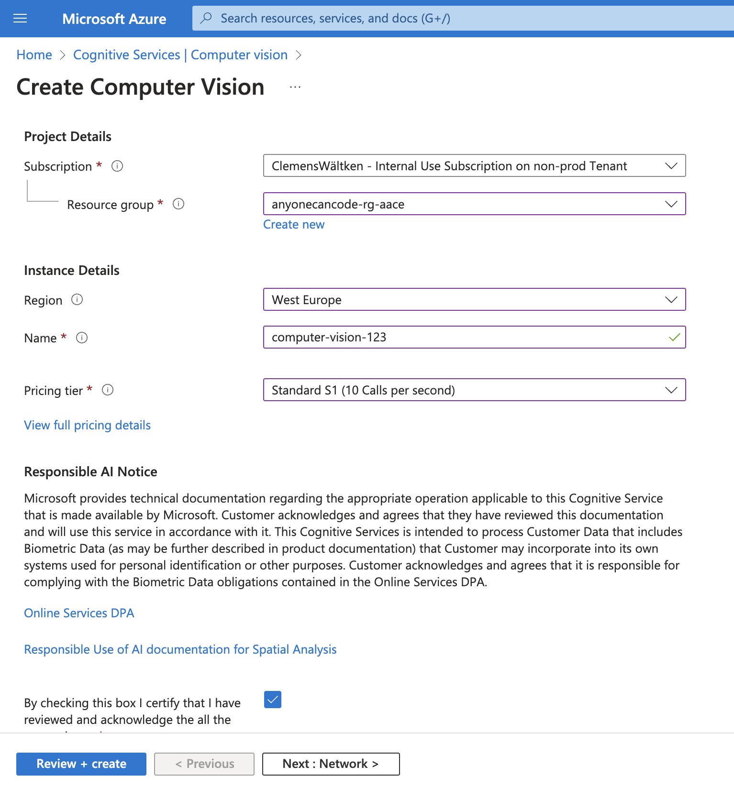
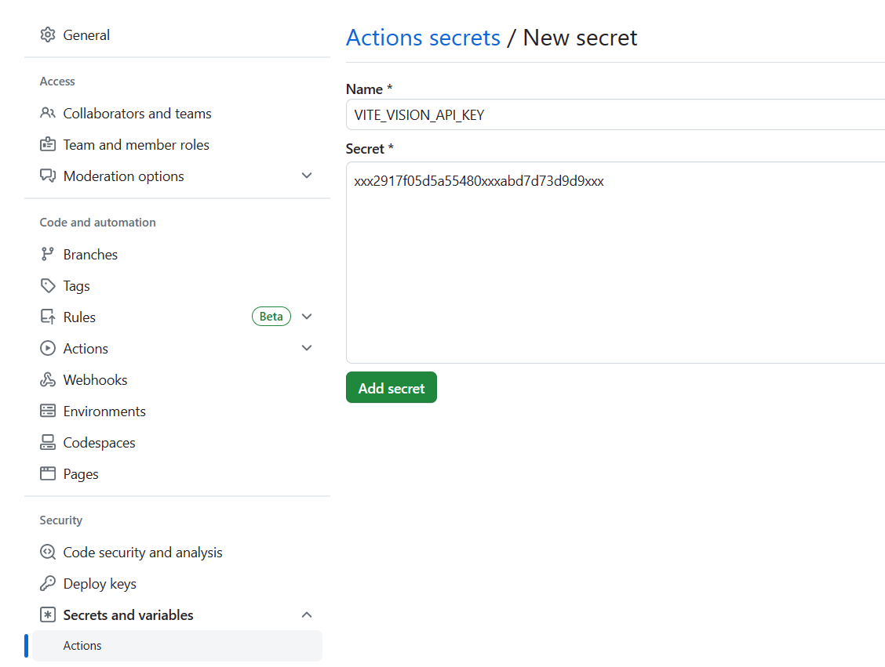
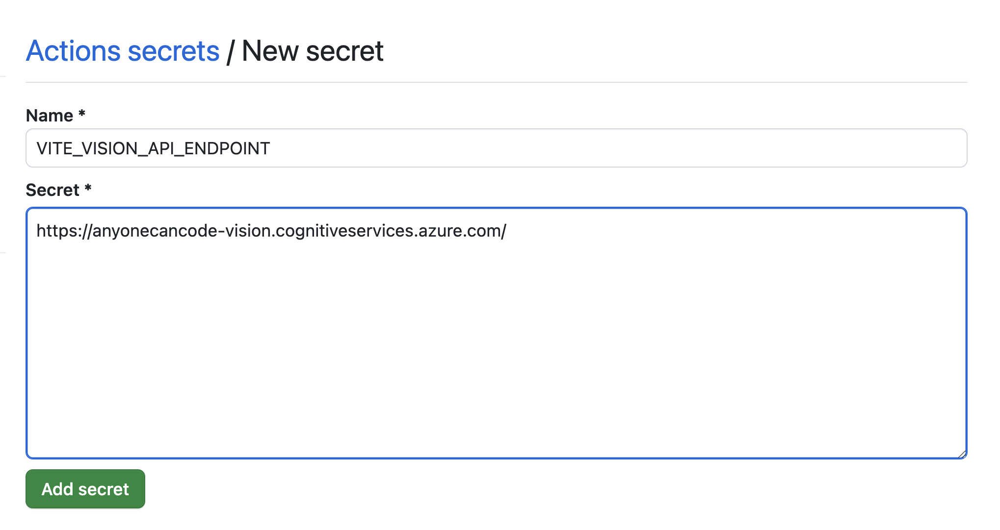

# Défi 5: Reconnaissance d'objets

⏲️ _temps estimé pour terminer: 30 min._ ⏲️

## Voici ce que vous allez apprendre 🎯

Dans ce défi, vous apprendrez comment:

- Créer un service Azure de type API Vision
- Connecter votre service Azure : API Vision avec votre application
- Transmettre la clé API à votre application à l'aide des secrets GitHub
- Commencer à détecter des objets avec votre application

## Table des matières

### Ressources informatives supplémentaires

- [Qu'est-ce qu'une ressource / groupe de ressources / abonnement?](https://docs.microsoft.com/azure/cloud-adoption-framework/govern/resource-consistency/resource-access-management)
- [API de Vision](https://azure.microsoft.com/en-us/products/cognitive-services/vision-services/)
- [Régions et zones de disponibilité dans Azure](https://docs.microsoft.com/azure/availability-zones/az-overview)
- [Secrets chiffrés GitHub](https://docs.GitHub.com/en/actions/reference/encrypted-secrets)

## Commencer

- Naviguez vers votre **Groupe de ressources** que nous avons créé le premier jour lors des défis précédents.
- Créez une nouvelle **Ressource** et recherchez **Azure AI services**.
  
  

## Créer un service cognitif de vision par ordinateur

- Sélectionnez **Services cognitifs** et cliquez sur **Créer**.
- Votre abonnement et votre groupe de ressources devraient déjà être définis. Sélectionnez **westeurope** comme région et **Standard S0**.
  ⚠️ Attention: westeurope est codé en dur - assurez-vous donc d'avoir cette ressource dans westeurope
- Donnez un nom unique à la ressource.
- Cliquez sur **Examiner + créer** puis sur **Créer**.
  
- Une fois la ressource créée, comme pour les défis du premier jour, copiez cette fois uniquement la clé pour la stocker dans les **Secrets GitHub**

## Intégrer les informations d'identification du service de vision par ordinateur dans le secret GitHub

Vous devez partager les informations de cette ressource avec l'application Web, afin qu'elle puisse utiliser l'_intelligence_ du service de vision par ordinateur. Par conséquent, nous allons créer deux autres secrets GitHub et les partager avec l'application.

- Naviguez vers GitHub > Paramètres > Secrets > Actions et ajoutez un `Nouveau secret de dépôt`.
- Nom: `VITE_VISION_API_KEY`
- Valeur: La clé de votre service de vision par ordinateur que vous avez copiée auparavant
- Ajouter un secret.

- Naviguez vers GitHub > Paramètres > Secrets > Actions et ajoutez un `Nouveau secret de dépôt`.
- Nom: `VITE_VISION_API_ENDPOINT`
- Valeur: Le point de terminaison API de votre service de vision par ordinateur que vous avez copié auparavant
- Ajouter un secret.

## Exécutez à nouveau le pipeline Frontend

- Naviguez vers **Actions** > **Pages** et **Exécutez le workflow**
  

Cliquez sur le lien frontend affiché sous l'étape de déploiement sous votre pipeline `https://<yourgithubhandle>.github.io/...` ou ouvrez l'application sur votre téléphone.

Notre application frontend devrait maintenant avoir un nouveau bouton avec un symbole d'image qui nous permet de détecter notre objet sur une image et de reconnaître notre objet sur l'image.

Ni la photo que vous prenez ni ce qui est détecté ne sera sauvegardé et n'apparaîtra **pas** sur la chronologie ou le fil d'actualité.

## Regardez autour de vous! Que peut détecter votre application? Jouez autour

Alors allez-y et détectez au moins 5 objets et dites-nous à quel point votre application détecte bien les objets sur les images.

Jetez également un œil à vos objets détectés ou demandez à d'autres personnes de comparer à quel point leurs objets ont été détectés, vous pourriez être surpris.

[◀ Défi précédent](../Github/README_FR.md) | [🔼 Accueil](../../../README_FR.md) | [Prochain défi ▶](../../day2/Speech/README_FR.md)

### Surchargé? Nous vous avons couvert

Demandez à votre coach si vous n'avez pas réussi. Nous vous avons couvert avec une sauvegarde. ⚠️

### Utilisez le service Backend Milligram préparé

Regardez l'application préparée avec nos photos pour que vous puissiez jouer autour [Milligram](https://microsoft.github.io/everyonecancode/).
